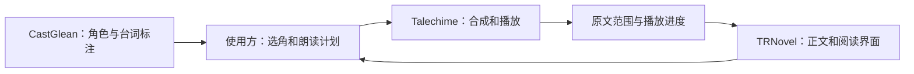

<p align="center">
  
</p>

# Talechime · 叙铃

**让故事响起来。**

Talechime 是一个 Rust 本地语音合成与长文听书项目，提供可复用的会话核心、模型适配器、命令行程序和 JSON Lines worker。它从 [TRNovel](https://github.com/yexiyue/TRNovel) 的 novel-tts 拆出，让阅读器和其他文本应用共享同一套合成、播放、取消与恢复能力。

*Local speech synthesis and continuous listening, built in Rust.*

[文档索引](docs/README.md) · [架构与集成](docs/architecture.md) · [Rust 库](docs/library.md) · [开发与验证](docs/development.md) · [品牌资产](docs/brand.md) · [迁移来源](SOURCE.md)

> **状态：独立源码仓库，尚未发布新品牌安装包。** 当前可以从源码构建、朗读 UTF-8 文件、管理音色或作为本地 worker 接入应用。Rust 会话核心已支持同模型多音色增量计划及整章磁盘暂存后播放；CLI/worker 已使用统一计划入口；CastGlean 集成和通用有声书导出尚未实现。

## 已经能做什么

- 本地朗读 UTF-8 长文，支持暂停、继续、停止、播放速度和音量调整。
- 流式 PCM、连续音频队列和自适应预缓冲；队列以音频时长及字节数限制内存。
- 按实际播放进度保存原文 UTF-8 字节检查点，支持中断恢复和从头重播。
- 在编译时选择 MOSS、Qwen3-TTS、VoxCPM2 和 OmniVoice 适配器。
- 按模型能力列出、导入、移除或设计可复用音色；风格和克隆能力由模型报告。
- 通过版本化 JSON Lines 控制播放并接收状态、资源进度、原文范围和错误。
- 片段级原文进度与高亮，不加载额外的对齐模型。

模型推理在专用线程运行，音频留在 worker 进程。正文和参考音频由本地模型处理；首次准备需要下载所选模型，普通帮助和音色目录查询不下载权重。无需 Python 即可使用 Rust 程序；`tools/tts/` 中的 Python 是开发对照与验收工具。

## 嵌入 Rust 应用

`talechime` library 提供 `Engine::prepare / synthesize / synthesize_pcm / listen`，直接合成无需播放器或检查点。宿主提供模型资源目录、runtime 和线程；音色与播放设置分开。流式 PCM、同模型多音色计划和整章暂存后播放复用 core 执行规则。详见 [Rust 库入口](docs/library.md)，无需模型的示例可直接运行：

```sh
cargo run --locked -p talechime --example synthesize
cargo run --locked -p talechime --example listen_plan
```

## Installation

独立发行使用 cargo-dist **0.32.0**，只提供 `talechime`。首轮支持 Apple Silicon macOS、x86_64 Linux GNU、x86_64 Windows MSVC。新流程已配置，尚未创建正式应用 release tag；下列命令在首个新品牌应用 release 发布后可用。当前可使用源码构建。

```sh
# macOS / Linux
curl --proto '=https' --tlsv1.2 -LsSf https://github.com/yexiyue/talechime/releases/latest/download/talechime-installer.sh | sh
brew install yexiyue/tap/talechime
```

```powershell
irm https://github.com/yexiyue/talechime/releases/latest/download/talechime-installer.ps1 | iex
```

也可从 [GitHub Releases](https://github.com/yexiyue/talechime/releases) 下载 `.tar.xz` / `.zip`，解压后加入 PATH。标准包包含 Nano、Qwen / VoxCPM / OmniVoice；Mac 增加 Metal（含 Nano、Local / Realtime Candle），Windows/Linux 使用 CPU。CUDA 保留源码构建与编译 CI。模型按需下载，安装包不含模型权重。

Mac 标准包要求 macOS 15+（Candle Metal residency set API）。Linux 标准包基于 Ubuntu 24.04 构建，需要 glibc 2.39+、对应的 libstdc++ 和 ALSA 运行库。Windows 使用动态 MSVC CRT，需要 Visual C++ Redistributable。帮助与协议握手不要求模型、CUDA、GPU 或音频设备。

## 从源码开始

需要 Rust 1.89 或更新版本及平台链接工具。Linux 需要 ALSA/OpenSSL 开发库和 pkg-config；CUDA 构建另外需要 Toolkit，Metal 需要 macOS。实际最低工具链与各平台模型性能须分别验证，不能由编译成功推断。

```bash
git clone https://github.com/yexiyue/talechime.git
cd talechime
cargo run -- --help
cargo run -- --version
cargo run -- voices list
cargo run --release -- chapter.txt
```

默认构建包含 Candle MOSS Nano（`nano-candle`）。新用户的实际默认模型由本构建中的模型及设备目录决定；已有配置保留用户选择。可显式指定 CPU MOSS：

```bash
cargo run --release -- --backend moss --tts-device cpu chapter.txt
```

交互控制：`Space` 暂停/继续，`s` 停止，`q` 退出。`--restart` 忽略该文件已有恢复点并从头朗读：

```bash
cargo run --release -- --restart chapter.txt
```

模型只在实际准备/朗读时按需下载。某些模型数 GB，下载与校验可能需要时间。损坏资源会隔离并重新获取；不会自动跳过合成失败的正文。

## 选择模型和设备

| 后端 | 当前实现 | 设备与能力边界 |
| --- | --- | --- |
| MOSS Nano | Candle（默认） | CPU；显式 feature 启用 Metal / CUDA；支持段落内接续 |
| MOSS Nano ONNX | ONNX Runtime | 显式选择 `nano`；可选 ORT provider，须核验实际算子与硬件覆盖 |
| MOSS Local / Realtime | Candle | 可选 CUDA / Metal，GPU 试用模型 |
| Qwen3-TTS | Candle | CustomVoice 预置音色；1.7B CustomVoice 支持风格；Base 支持参考克隆 |
| VoxCPM2 | Candle | Q8 GGUF 路径与实验 BF16 路径；参考音色与设计，按编译设备使用 |
| OmniVoice | Candle | 参考音色与设计；当前为语义分段生成，不是原生实时流式 |

```bash
# NVIDIA：源码构建 Qwen CUDA
cargo build --release -p talechime --no-default-features --features cli,qwen-cuda --bin talechime
target/release/talechime --backend qwen --model 1.7b-customvoice --tts-device cuda chapter.txt

# Apple Silicon
cargo build --release -p talechime --features qwen-metal
target/release/talechime --backend qwen --tts-device metal chapter.txt

# 扩展其他 Candle 后端
cargo build --release -p talechime --features qwen,voxcpm,omnivoice
```

`ort-cuda` 和 `qwen-cuda` 是不同计算路径；启用一个不会为另一个提供 GPU 支持。当前原生 ORT CUDA 分发在部分 Blackwell 算子上存在覆盖问题，见[验收记录](docs/records/ort-rc13-upgrade.md)。实际能力以编译目录与运行检查为准。

各模型的数值、听感、流式边界与连续播放验收状态不同。已有适配器不等于所有模型和设备均已完成质量验收；详情见[模型验收记录](docs/records/tts-model-tiers-acceptance.md)及[VoxCPM 记录](docs/records/voxcpm-candle-acceptance.md)。

## 音色

```bash
talechime --backend moss voices list
talechime --backend moss voices import reader --name "我的朗读音色" --text "参考音频的准确文字" reference.wav
talechime --backend moss --voice custom:reader chapter.txt
talechime --backend moss voices remove reader
```

克隆或设计需所选模型支持。Qwen 的克隆使用 Base，设计先生成一次短参考，随后用 Base 复用；CustomVoice 使用预置音色。不同模型的参考长度、采样率和资源要求由适配器验证，音色不会因为 ID 相同就自动跨模型兼容。

## 接入应用

```bash
talechime --protocol
```

stdin/stdout 使用 UTF-8 JSON Lines；stderr 用于日志，协议模式不接管终端。客户端先发送 `hello`，核验 `protocol_version` 和模型能力，再发送准备/播放命令。当前协议主版本是 **7**，已移除对齐配置与句子事件。

```json
{"protocol_version":7,"request_id":"hello-1","session_id":null,"type":"hello"}
```

`talechime-protocol` 只依赖轻量序列化、哈希和错误库。阅读器可共享其 DTO，同时把模型与音频隔离在进程中；Rust 应用优先调用 `talechime::Engine`，通过 `run_local` 使用宿主 runtime。核心不自行创建应用运行时。

### 完整计划与整章播放

```sh
# 单音色，整章成功生成后再播放
cargo run --release -- chapter.txt --after-chapter
# 完整同模型多音色计划，正文必须与文件完全一致
cargo run --release -- chapter.txt --plan chapter-plan.json
```

计划文件是协议的 `PlanRequest` payload，必须 sealed=true；播放策略及来源身份由计划提供。`--restart` 强制从零播放，否则使用计划的 resume_byte / restore_checkpoint。增量输入通过 JSON Lines v7 的 start/append/seal，详见[协议说明](crates/talechime-protocol/README.md)。先稳定 Talechime 通用 API，CastGlean 完成后再共同接入 TRNovel。

## 与 TRNovel、CastGlean 的分工



上图中 CastGlean 到朗读计划的连接是规划能力。CastGlean 保留稳定角色身份与语义分析，使用方绑定具体音色，Talechime 负责声音。Talechime 当前不依赖 CastGlean，也不分析谁在说话。

## 数据目录

| 数据 | 默认路径 |
| --- | --- |
| 配置 | `~/.talechime/config.json` |
| 听书恢复点 | `~/.talechime/checkpoints/` |
| 模型、音色、编码缓存与校准资源 | `~/.talechime/resources/` |

保留 `--config`、`--checkpoint-dir`、`--model-dir` 显式参数。旧 `novel-tts` 入口已移除，旧目录不读取、不删除、不自动迁移；复用已有资源见[手工搬迁](docs/migration.md)。配置使用修订检查和原子替换，损坏数据不覆盖；退休后端需手工重新选择。

## 路线图

- [x] 从 TRNovel 提取独立 Rust workspace，确立通用库边界。
- [x] 独立 CLI、项目文档与品牌资产。
- [x] cargo-dist 发行配置与三个平台的隔离构建/启动 CI。
- [ ] 创建首个正式应用 release，并完成真实模型跨平台试听。
- [x] 通用朗读计划：同一模型内逐段指定音色/风格，连续播放。
- [ ] CastGlean 标注适配、角色音色绑定和未知归属回退。
- [ ] 长文音频导出与可复用音频缓存。

## 开发与许可证

工作区包含 CLI、协议、核心、后端及本地模型计算库。构建和检查见[开发说明](docs/development.md)，第三方来源见各组件的 `SOURCE.md`、`LICENSE*` 和[许可说明](docs/licenses.md)。模型权重、用户音频和小说正文不随仓库分发。

原创项目代码沿用 MIT。第三方组件与模型保留各自授权，整个模型集合不能统一视为 MIT；品牌图片由内置图像工具生成，提示词和资产记录见[品牌说明](docs/brand.md)。

## 可选回读校验

首版内置 Qwen3-ASR 0.6B 主识别与 SenseVoiceSmall 复核，默认关闭。库支持独立报告、仅报告合成及逐片段门禁/有界重试；标准发行包包含 `asr`，嵌入库按需启用该 feature。准备模型与合成分开，调用过程中不隐式下载。使用方法及边界见[回读校验](docs/readback.md)。

## 段落内接续

OmniVoice、Qwen **0.6B / 1.7B Base**、VoxCPM2 与 MOSS Nano / Local / Realtime 默认使用前段完整文字/音频条件，软换行和
同音色连续分块保留参考，硬段落及音色变化重置。`--no-continuation` 可关闭，优先于计划文件。
支持接续不代表主观听感已验收；规则及库选项见[段落内接续](docs/library.md#段落内接续)。

```sh
# Qwen Base 需要自行导入带准确转写的参考；CustomVoice 默认选择保持不变。
talechime --backend qwen --model 0.6b-base voices import reader --name "朗读" --text "参考音频的准确文字" reference.wav
talechime --backend qwen --model 0.6b-base --voice custom:reader chapter.txt
talechime --no-continuation chapter.txt
```

## Nano Candle 默认实现

`moss-nano-candle` 是从既有实验分支移植的 Nano 原生实现，模型项为 `nano-candle`。
`moss-nano-candle-metal` / `moss-nano-candle-cuda` 分别启用对应设备；CPU 始终可用。
共享 Nano 音色 codes，并支持段落内接续。官方 prompt 修正后，本次固定语料试听已获用户确认，现作为默认 Nano 实现。
ONNX 保留为显式模型项 `nano`；已有配置若明确选择该项，仍按原选择执行，可用 `--model nano-candle` 切换。

```sh
cargo build --release --locked -p talechime --features moss-nano-candle-metal
target/release/talechime --backend moss --model nano-candle --tts-device metal --voice Weiguo chapter.txt
```

权重使用独立固定 manifest 和 `resources/moss/models/nano-candle/REVISION/` 目录；没有旧目录自动回退。
已有资源需显式指定 `--model-dir` 或手工搬迁，音色导入目前仍复用 Nano ONNX encoder。
