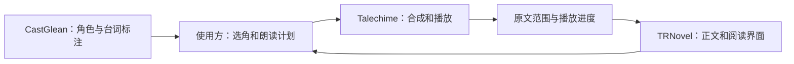

<p align="center">
  
</p>

# Talechime · 叙铃

**让故事响起来。**

Talechime 是一个 Rust 本地语音合成与长文听书项目，提供可复用的会话核心、模型适配器、命令行程序和 JSON Lines worker。它从 [TRNovel](https://github.com/yexiyue/TRNovel) 的 novel-tts 拆出，让阅读器和其他文本应用共享同一套合成、播放、取消与恢复能力。

*Local speech synthesis and continuous listening, built in Rust.*

[架构与集成](docs/architecture.md) · [开发与验证](docs/development.md) · [品牌资产](docs/brand.md) · [迁移来源](SOURCE.md)

> **状态：独立源码仓库，尚未发布新品牌安装包。** 当前可以从源码构建、朗读 UTF-8 文件、管理音色或作为本地 worker 接入应用。单个会话使用一套音色；按角色连续切换音色、CastGlean 集成和通用有声书导出仍在规划中。

## 已经能做什么

- 本地朗读 UTF-8 长文，支持暂停、继续、停止、播放速度和音量调整。
- 流式 PCM、连续音频队列和自适应预缓冲；队列以音频时长及字节数限制内存。
- 按实际播放进度保存原文 UTF-8 字节检查点，支持中断恢复和从头重播。
- 在编译时选择 MOSS、Qwen3-TTS、VoxCPM2 和 OmniVoice 适配器。
- 按模型能力列出、导入、移除或设计可复用音色；风格和克隆能力由模型报告。
- 通过版本化 JSON Lines 控制播放并接收状态、资源进度、原文范围和错误。
- 可选句子对齐；关闭时仍有片段进度，不加载对齐模型。

模型推理在专用线程运行，音频留在 worker 进程。正文和参考音频由本地模型处理；首次准备需要下载所选模型，普通帮助和音色目录查询不下载权重。无需 Python 即可使用 Rust 程序；`tools/tts/` 中的 Python 是开发对照与验收工具。

## 从源码开始

需要 Rust 1.89 或更新版本及平台链接工具。Linux 需要 ALSA/OpenSSL 开发库和 pkg-config；CUDA 构建另外需要 Toolkit，Metal 需要 macOS。实际最低工具链与各平台模型性能须分别验证，不能由编译成功推断。

```bash
git clone https://github.com/yexiyue/talechime.git
cd talechime
cargo run -- --help
cargo run -- --version
cargo run -- voices list
cargo run --release -- chapter.txt
```

默认构建包含 MOSS Nano 和可选对齐实现，对齐默认关闭。新用户的实际默认模型由本构建中的模型及设备目录决定；已有配置保留用户选择。可显式指定 CPU MOSS：

```bash
cargo run --release -- --backend moss --tts-device cpu chapter.txt
```

交互控制：`Space` 暂停/继续，`s` 停止，`q` 退出。`--restart` 忽略该文件已有恢复点并从头朗读：

```bash
cargo run --release -- --restart chapter.txt
```

模型只在实际准备/朗读时按需下载。某些模型数 GB，下载与校验可能需要时间。损坏资源会隔离并重新获取；不会自动跳过合成失败的正文。

## 选择模型和设备

| 后端 | 当前实现 | 设备与能力边界 |
| --- | --- | --- |
| MOSS Nano | ONNX Runtime | CPU 默认基线；可选 ORT provider，须核验实际算子与硬件覆盖 |
| MOSS Local / Realtime | Candle | 可选 CUDA / Metal，GPU 试用模型 |
| Qwen3-TTS | Candle | CustomVoice 预置音色；1.7B CustomVoice 支持风格；Base 支持参考克隆 |
| VoxCPM2 | Candle | Q8 GGUF 路径与实验 BF16 路径；参考音色与设计，按编译设备使用 |
| OmniVoice | Candle | 参考音色与设计；当前为语义分段生成，不是原生实时流式 |

```bash
# NVIDIA：Qwen 及兼容 CLI 一起构建
cargo build --release -p talechime --no-default-features --features qwen-cuda
target/release/talechime --backend qwen --model 1.7b-customvoice --tts-device cuda chapter.txt

# Apple Silicon
cargo build --release -p talechime --features metal
target/release/talechime --backend qwen --tts-device metal chapter.txt

# 扩展其他 Candle 后端
cargo build --release -p talechime --features qwen,voxcpm,omnivoice
```

`ort-cuda` 和 `qwen-cuda` 是不同计算路径；启用一个不会为另一个提供 GPU 支持。当前原生 ORT CUDA 分发在部分 Blackwell 算子上存在覆盖问题，见[验收记录](dev-notes/ort-rc13-upgrade.md)。实际能力以编译目录与运行检查为准。

各模型的数值、听感、流式边界与连续播放验收状态不同。已有适配器不等于所有模型和设备均已完成质量验收；详情见[模型验收记录](dev-notes/tts-model-tiers-acceptance.md)及[VoxCPM 记录](dev-notes/voxcpm-candle-acceptance.md)。

## 音色

```bash
talechime --backend moss voices list
talechime --backend moss voices import reader --name "我的朗读音色" --text "参考音频的准确文字" reference.wav
talechime --backend moss --voice custom:reader chapter.txt
talechime --backend moss voices remove reader
```

克隆或设计需所选模型支持。Qwen 的克隆使用 Base，设计先生成一次短参考，随后用 Base 复用；CustomVoice 使用预置音色。不同模型的参考长度、采样率和资源要求由适配器验证，音色不会因为 ID 相同就自动跨模型兼容。

## 接入应用

```bash
talechime --protocol
```

stdin/stdout 使用 UTF-8 JSON Lines；stderr 用于日志，协议模式不接管终端。客户端先发送 `hello`，核验 `protocol_version` 和模型能力，再发送准备/播放命令。当前协议主版本是 **5**。

```json
{"protocol_version":5,"request_id":"hello-1","session_id":null,"type":"hello"}
```

`talechime-protocol` 只依赖轻量序列化、哈希和错误库。阅读器可共享其 DTO，同时把模型与音频隔离在进程中；Rust 应用也可直接装配 core/backends，需在自己的 Tokio `LocalSet` 中运行会话。核心不自行创建应用运行时。

## 与 TRNovel、CastGlean 的分工



上图中 CastGlean 到朗读计划的连接是规划能力。CastGlean 保留稳定角色身份与语义分析，使用方绑定具体音色，Talechime 负责声音。Talechime 当前不依赖 CastGlean，也不分析谁在说话。

## 兼容与数据目录

同时构建 `talechime` 与旧名称 `novel-tts`，两者运行相同逻辑。TRNovel 现有程序发现和发行包可以继续使用 `novel-tts`。

| 数据 | 保留路径 |
| --- | --- |
| 配置 | `~/.novel/tts_config.json` |
| 听书恢复点 | `~/.novel/tts/checkpoints/` |
| 模型、音色与编码缓存 | `~/.novel-tts/` |

可通过 `--config`、`--checkpoint-dir` 和 `--model-dir` 显式隔离。新名称不触发目录迁移、重新下载或用户偏好重置。配置文件采用修订检查和原子替换；正文摘要或 UTF-8 坐标不匹配的恢复点会报错。恢复可能重复最近未完成片段，不承诺采样级恢复。

## 路线图

- [x] 从 TRNovel 提取独立 Rust workspace，保留协议和用户数据兼容。
- [x] 新品牌 CLI、兼容入口、项目文档与品牌资产。
- [ ] 完成独立安装包及 Windows / Linux / Apple Silicon 发布验收。
- [ ] 通用朗读计划：同一模型内逐段指定音色/风格，连续播放。
- [ ] CastGlean 标注适配、角色音色绑定和未知归属回退。
- [ ] 长文音频导出与可复用音频缓存。

## 开发与许可证

工作区包含 CLI、协议、核心、后端及本地模型计算库。构建和检查见[开发说明](docs/development.md)，第三方来源见各组件的 `SOURCE.md`、`LICENSE*` 和[许可说明](docs/licenses.md)。模型权重、用户音频和小说正文不随仓库分发。

原创项目代码沿用 MIT。第三方组件与模型保留各自授权，整个模型集合不能统一视为 MIT；品牌图片由内置图像工具生成，提示词和资产记录见[品牌说明](docs/brand.md)。
