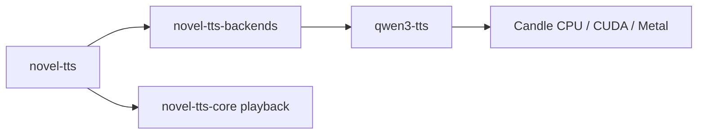

# qwen3-tts

TRNovel's local Candle inference library. Imported from
[TrevorS/qwen3-tts-rs](https://github.com/TrevorS/qwen3-tts-rs) at revision
`711ceee07cad92673f86de8997bdf54c30caa49f`, under the upstream MIT license.
The original implementation and contributors retain attribution. Local changes
use the repository's MIT license as well.

This crate reads local model files and generates PCM. `novel-tts-backends`
adapts that stream to the session API; the worker owns verified downloads,
calibration, configuration and playback. No upstream CLI, model downloader,
benchmarks, Python tooling or custom PTX assets are included.



## Features

- Default: CPU, with no GPU SDK requirement.
- `cuda`: Candle CUDA on Windows/Linux; requires CUDA Toolkit and `nvcc`.
- `metal`: Candle Metal on macOS.
- `profiling`: optional Chrome trace output for diagnostics.

GPU features are platform-specific; do not use `--all-features` across platforms.
All three Candle packages are pinned to 0.9.2 in the workspace. Explicit device
requests fail if initialization fails; only Auto may fall back to CPU.

## Local changes

- Library-only Cargo manifest and workspace dependencies; Rust 2024 and `foo.rs`
  module layout.
- Disable tokenizers' default features; retain `onig` for the Qwen tokenizer.
  The training-only `esaxx_fast` C++ implementation caused an MSVC `/MT` versus
  ONNX Runtime `/MD` link conflict. No compiler flag workaround is needed.
- Downloads remain in the worker's verified resource pipeline.
- The public facade is `lib.rs`; model orchestration lives in `synthesis.rs`,
  streaming and options in `synthesis/`. Device construction lives in `device.rs` and is shared by availability probes
  and model loading. CUDA initialization never silently returns a CPU device.
- Residual normalization uses Candle's own operators on the selected device.
  The upstream custom fused PTX and Flash Attention integration are omitted.
  The existing preallocated CUDA KV cache remains part of model inference.

## Worker builds and diagnostics

```sh
cargo build --release -p novel-tts --no-default-features --features qwen
cargo build --release -p novel-tts --no-default-features --features qwen-cuda
cargo build --release -p novel-tts --no-default-features --features metal
```

`qwen-cuda` accelerates Qwen through Candle. `ort-cuda` independently accelerates
MOSS and the alignment model through ONNX Runtime. Enable both only when needed.

For RTX 50 series, use a Blackwell-capable Toolkit (12.8 or newer), with a
compatible MSVC host compiler. The `nvidia-smi` CUDA version describes the driver,
not the installed Toolkit. A GPU-less build runner must set `CUDA_COMPUTE_CAP`
to the intended target architecture rather than detect its nonexistent GPU.

```sh
cargo run --release -p novel-tts-backends --no-default-features --features qwen-cuda --example qwen -- MODEL_DIR output.wav cuda '你好，欢迎收听。'
```

The probe requires real local model files and checks PCM and EOS. Record first
PCM latency, total generation time, audio duration and memory separately from
compilation. Compilation alone does not establish GPU acceleration or audio quality.
