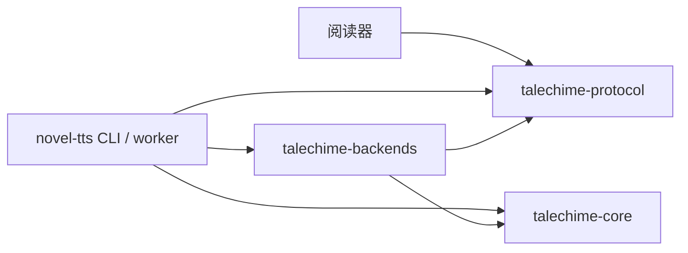

# talechime-backends

具体模型实现和资源目录。会话、播放和检查点由 `talechime-core` 管理；CLI/worker 通过 `Registry` 组装，阅读器不依赖本 crate。



## 编译组合

```sh
cargo build -p talechime                                  # MOSS 默认
cargo build --release -p talechime --features qwen,metal   # macOS: MOSS + Candle Qwen
cargo build --release -p talechime --no-default-features --features qwen-cuda # NVIDIA GPU
```

`Registry` 暴露已编译后端的能力、默认音色及显示名称，按需准备一个模型。后端扩展实现 core 的 `Backend::stream` 和 `Backend::segments`，无需改变播放器或阅读器。

## MOSS GPU（Candle）

MOSS 也可通过 `moss-candle-cuda` / `moss-candle-metal` 增加 GPU 试用模型
`local-1.7b` 和 `realtime-1.7b`。计算与 codec 位于 `crates/moss-tts`，共用
工作区 Candle；Nano 继续走原 ONNX。VoiceGenerator 仅用于创建可复用参考音色。
资源与真实验收边界见 `dev-notes/moss-candle-acceptance.md`。

## Qwen TTS（Candle）

适配 [TrevorS/qwen3-tts-rs](https://github.com/TrevorS/qwen3-tts-rs)，固定实现 revision `711ceee07cad92673f86de8997bdf54c30caa49f`。源码已纳入 `crates/qwen3-tts`，保留 MIT 授权和来源记录；推理库只读取本地模型，下载与校验由 worker 负责。

支持 `0.6b-customvoice`、`1.7b-customvoice`、`1.7b-base`。旧 Qwen 配置及 0.6B 目录保留；新增模型与 VoiceDesign 资源按模型 ID/revision 隔离。固定清单在 `src/qwen/resources.json` 和 `src/qwen/models/`，分别约 2.50 GB、4.52 GB、4.54 GB；VoiceDesign 约 4.52 GB，仅创建参考音色时下载。模型授权为 Apache-2.0，上游 Rust 实现为 MIT。

CustomVoice 提供九种预置音色，默认福叔 `uncle_fu`；1.7B 支持朗读风格。Base 使用导入的参考 WAV/文本及可复用编码缓存进行渐进克隆；VoiceDesign 只创建一次短参考片段，随后由 Base 播放。随机种子固定 42；GPU 二十帧、CPU 十帧一块，最多 375 帧。取消在帧及解码边界检查；只有真实 EOS 和有效 PCM 才发送 End，超限片段不写完成检查点。

Qwen 分段独立于 MOSS 的 token 预算：真实段落和标题建立硬边界；合并软换行，在 180 UTF-8 字节内优先切完整句末、分句、单词和字符边界。原文不修改，装饰线跳过，正文运算符保留。

CPU、可选 CUDA（Windows/Linux，`qwen-cuda`）和 Metal（macOS，`metal`）由 Qwen 自己的设备目录报告。`ort-cuda` 仅用于 MOSS/对齐器，不能为 Qwen 提供 CUDA。`tts-candle-platform` 按目标平台启用同一套 Candle 0.11.0 的 GPU 依赖，Windows 的 all-features 不会编入 Objective-C Metal。CUDA feature 仍需 Toolkit。Auto 使用同一完整链路校准门槛；运行错误仅在 Auto 模式重建 CPU 供下次显式播放，不重放失败片段。

流式 codec 的边界连续性需要人工试听，EOS 也不能证明逐字覆盖。当前各模型实测与待验收项见 `dev-notes/tts-model-tiers-acceptance.md`。

```sh
cargo run --release -p talechime-backends --no-default-features --features qwen,metal --example qwen -- ~/.novel-tts/qwen output.wav metal '你好，欢迎收听。'
TRNOVEL_QWEN_MODEL_DIR=~/.novel-tts/qwen cargo test --release -p talechime-backends --features qwen real_model_streams_and_releases_cancelled_request
```

## MOSS

CPU ONNX 推理在独立线程执行。通道容量为 1；消费者丢弃流后，生成在推理步骤之间终止。SentencePiece 按 50 token / 60 个 CJK 字符预算合并相邻句子，超限优先在句末分段，保存原文范围，合成副本执行空白/标点规范化。首版不引入官方 Python 可选的 WeText 数字规范化包。

资源位于 `~/.novel-tts/moss/{tts,codec}`，自定义音色位于 `moss/voices`。`--model-dir` 覆盖的是公共根目录，子目录按后端和模型隔离。

固定资源清单位于 `src/moss/assets/resources.json`，每个文件记录下载 URL、大小和 SHA-256：

- TTS：OpenMOSS-Team/MOSS-TTS-Nano-100M-ONNX，revision `f52645cb467506d8e18e746ddd59482685b74e58`。
- Codec：OpenMOSS-Team/MOSS-Audio-Tokenizer-Nano-ONNX，revision `ceff0d0749bfb3fa2d61149794ec6feef0d1e1ae`。
- 总下载约 763 MB，包含 ONNX 外部权重。模型只在实际准备时下载；损坏文件隔离为 `.corrupt`，重新准备会补下载。

参考 WAV 支持 1..30 秒非静音 mono/stereo PCM 或 float，内部使用 sinc 重采样至 48kHz stereo。自定义 ID 使用 `custom:<name>`，缓存模型 revision 和编码结果；重复 ID 拒绝覆盖，升级模型后需重新导入。CLI 导入后重新连接阅读器即可刷新音色目录。

## 原生验收

```sh
cargo run -p talechime-backends --example moss -- <root>/moss output.wav '你好，欢迎使用听书功能。'
# 第三个参数也可使用 @文本文件；第四个参数指定音色
TRNOVEL_MOSS_MODEL_DIR=<root>/moss cargo test -p talechime-backends
```

普通测试不下载模型；设置环境变量后才执行真实模型的官方数值对照和取消测试。官方参考 fixture 来自 upstream commit `8b7bcc9341b3b4ef3a3a58ba1338a7d85ff133eb` 的 `ort_cpu_runtime.py`，使用官方 fixed sampling 图、三个 codec frame 一块和 seed=42 的固定 LCG 随机数序列。fixture 包含 SentencePiece tokens、样本数和跨音频范围的 512 个 PCM 探针；误差容限为 1e-4。随机序列用于验收，正常播放使用系统种子随机源。

本地验收记录见 `dev-notes/moss-tts-acceptance.md`。Python 只用于生成官方对照数据，用户运行程序无需 Python。

## 上游来源和许可

MOSS 推理流程移植自 [OpenMOSS/MOSS-TTS-Nano](https://github.com/OpenMOSS/MOSS-TTS-Nano)。assets 中的 manifest、ONNX metadata 和参考音色 codes 来自上述固定模型 revision，按 Apache-2.0 提供；许可证保存在 `src/moss/assets/LICENSE.OpenMOSS`。原项目 Rust 代码继续使用仓库 MIT 许可。

## Qwen 对齐与设备

alignment feature 提供独立 `QwenAligner`，实现 core 的 `Aligner`，通过容量为 1 的请求通道在线程内运行；原文单位、16kHz mono、128-bin log-mel、分词、时间戳修复全部使用 Rust。来源为 [Qwen3-ASR](https://github.com/QwenLM/Qwen3-ASR) 和 [固定 ONNX 导出](https://huggingface.co/valoomba/Qwen3-ForcedAligner-0.6B-ONNX/tree/261c9ed100c1b18a4a1fbc488e05625dc9a4ae5c)，许可见 alignment/LICENSE.Qwen。

coreml/ort-cuda feature 启用对应 ORT provider，Rust ort 固定 rc.13，普通预编译 ORT 1.28、Rust API 21（实际原生库 1.22 或更新，设备由应用显式选择），CUDA 原生分发要求 CUDA 13；不再发布 Intel Mac 制品。设备与校准策略由 CLI 组装，不进入 core 或阅读器。CoreML 使用 NeuralNetwork、静态子图和独立编译缓存；CUDA 用 I/O binding 保留 KV/codec 状态。设备可用、子图分配与性能通过不同证据判断；验收见 `dev-notes/continuous-tts-acceptance.md`。

```sh
TRNOVEL_MOSS_MODEL_DIR=<root>/moss TRNOVEL_QWEN_MODEL_DIR=<root>/alignment/qwen cargo test -p talechime-backends
cargo run --release -p talechime-backends --features coreml --example device_calibration -- <root>/moss
```

## MOSS 连贯性与终止诊断

MOSS 软换行可共享上下文；初始目标 8 秒/预计上限 12 秒，保留 50 token/60 CJK/375 帧限制。标题规则复用轻量 protocol 的内置 TOC 常量。`stream_diagnosed` 提供可选报告（规范化文本/token/帧/时长/EOS、frame_limit、cancelled、inference_failure），只用于诊断，不用于推断完整朗读。`moss_probe` example 可生成固定 seed=42 的源范围、报告和 WAV；报告只写入显式输出目录。失败不发送成功 End，不自动重读，frame_limit 不触发设备回退。

## 新增原生后端

| 后端 / feature | 计算库 | 模型 | PCM / 流式 |
| --- | --- | --- | --- |
| VoxCPM2 / voxcpm[-cuda/-metal] | 工作区 Candle 0.11.0 | Q8_0 BaseLM + F16 Acoustic，3.55 GB | 48 kHz，原生流式 |
| OmniVoice / omnivoice[-cuda/-metal] | 工作区 Candle 0.11.0 | 0.6B，3.27 GB | 24 kHz，语义分段 |

推理模型在线程内创建、执行、释放；请求与音频通道容量为 1。取消通过接收通道关闭直接通知推理循环，无需 Tokio 继续调度；Drop 关闭请求并等待原生线程退出。切换模型须先停止会话、关闭音频接收端，再释放后端，避免重复占用显存。

统一音色管理保存参考 WAV、准确文字、描述及模型身份；模型专用提示由适配器懒编码并缓存。Vox 和 Omni 支持一次性设计参考再克隆。

来源与固定 revision：`crates/voxcpm-sys/native/SOURCE.md`、`crates/omnivoice/SOURCE.md`。Vox 代码 MIT、权重 Apache-2.0；Omni 生成器 Apache-2.0，但 tokenizer 使用 BOSON/Higgs/Llama 许可。不得将整个组件集合标作 Apache/MIT。

对照数值 fixture、固定语料、WAV、性能和待验收项见 `dev-notes/tts-model-tiers-acceptance.md`；普通测试不下载大模型。
