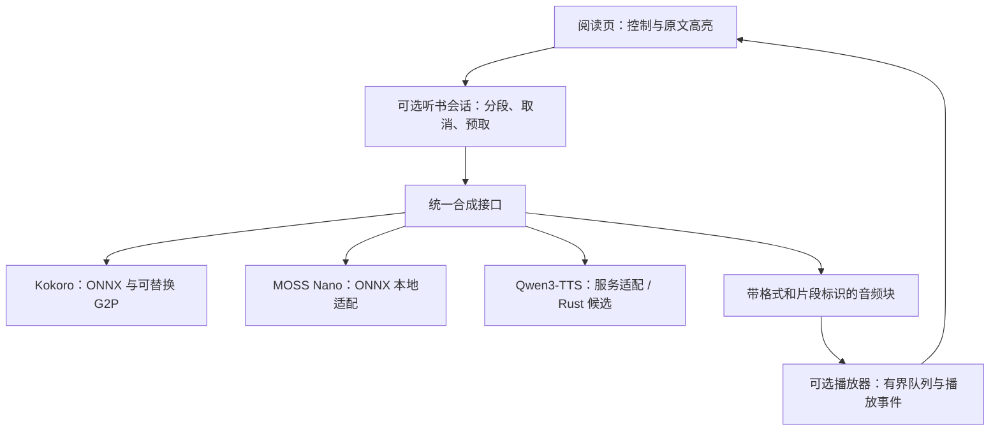
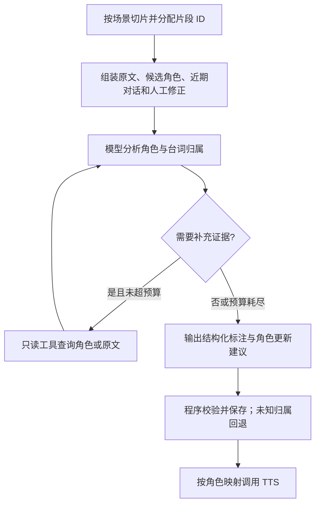

# 听书模块与多后端演进计划

> 本文保留最初讨论时的代码现状与方案。当前解耦实现的命名为 `novel-tts-core`（核心）、`novel-tts-protocol`（协议）、`novel-tts`（独立 CLI/协议程序），阅读器模块为 `src/tts.rs`；实施范围以 `openspec/changes/decouple-tts-process/` 为准。

日期：2026-10-05。状态：讨论稿，尚未实施。

本计划基于当前仓库源码、已安装的 `kokoro-tts 0.3.1` 源码及上游部署文档。上游性能数字不代表 TRNovel 实测结果；本次没有下载模型、生成试听音频或验证跨平台推理。正式修改行为前应建立对应 OpenSpec 提案。

## 目标与范围

听书成为可选模块，支持 MOSS-TTS-Nano、Qwen3-TTS，并保留 Kokoro。普通阅读用户可以使用不包含模型推理与音频播放依赖的构建；听书用户按需启用后端、下载模型。

优先改善中文小说的读音准确性、长文连贯性和持续播放体验。多音字、人物姓名、语气和停顿要分别验收，不能以模型参数量或采样率代替听感评价。

第一阶段不建设通用动态库插件系统，不纳入 IndexTTS，不自动识别角色并分配音色。独立进程后端属于听书模块的扩展点；是否提供一键安装、默认发行版是否启用听书，留到发布方案确定时决策。

## 当前实现与问题

| 耦合点 | 当前情况 | 计划边界 |
| --- | --- | --- |
| 根依赖 | `Cargo.toml` 无条件引入 `novel-tts` | 可选依赖与 feature 门控 |
| 章节处理 | `ChapterTTS` 直接持有 `Arc<KokoroTts>` | 面向统一合成接口 |
| 阅读页 | 持有章节合成器、播放器及 `NOVEL_TTS` | 只处理听书控制与播放事件 |
| 音色配置 | `src/cache/tts.rs` 将音色转换为 Kokoro `Voice` | 后端标识与后端自己的音色标识 |
| 播放格式 | `SamplesBuffer::new(1, 24000, data)` | 由后端报告采样率与声道数 |
| 文本分段 | `preprocess_text(text, 200)`，限制单位为 UTF-8 字节 | 按后端 token/长度能力分段，保留句子与上下文 |
| 正文高亮 | `TextSegment` 原文字节范围，播放时发送片段索引 | 保持原文坐标，按实际播放时间发进度 |

当前的“流式”是逐片段合成完整音频、排队播放，与模型原生逐块输出音频不同。统一接口要同时容纳两者。

### 多音字与语气是两个问题

这里的拼音转换应称为**文本前端 / G2P**，与生成声音的声学模型区分。

已安装依赖的 `src/g2p/v11.rs` 包含 jieba 分词、`dict/pinyin.dict` 词组词典、轻声/一/不/三声变调与儿化规则。`get_pinyin_fine` 优先查词组词典，未命中时由 `get_pinyin` 对每个字调用 `ToPinyin`。因此它并非完全没有多音字处理，但未发现按完整句子语义做消歧的神经模型。函数名 `neural_sandhi` 在这里也不能作为使用神经网络的证据，它实现的是规则处理。

读错“行、重、长、还”或人物姓氏，应优先检查词典、上下文消歧、变调顺序和音素编码。语气平淡或句子破碎，还可能来自声学模型能力、标点处理及过短的分段。200 字节约能容纳 66 个纯汉字，现有策略会在长句中进一步按逗号等切分；其影响需要单独做实验，不能未经试听就断定是根因。

## 架构建议

优先复用 `crates/novel-tts` 做独立领域模块，不预先拆成多个 crate。模块内部按 `backend/`、`session/`、`player/`、`text/`、`models/` 分工；公开接口不暴露 Kokoro、Candle 或 ONNX Runtime 类型。

建议的 feature 名称为 `tts`、`tts-kokoro`、`tts-moss`、`tts-qwen-service`；这是接口草案，不是现有配置。`tts` 覆盖听书 UI、会话和播放；其他 feature 覆盖具体后端。后续 Rust 原生 Qwen 支持可单独门控，避免所有用户承担 GPU 构建依赖。

关闭听书时，隐藏相关快捷键、帮助、下载及设置入口，主程序依赖树不应包含由听书引入的 `rodio`、`kokoro-tts`、`ort`。只在设置中关闭或懒加载模型，不能达到这个目标。检查应用包的依赖树与编译结果；`--workspace --all-features` 本来就会构建听书 crate，不能作为基础版已消除依赖的证明。

### 后端接口需要表达什么

- 能力查询：可用音色、是否支持流式、风格指令、克隆、语速和读音覆盖。界面按能力展示选项，不假设三个后端功能相同。
- 合成请求：请求/章节/片段标识、朗读文本、原文 UTF-8 范围、音色和可选后端参数。上下文只能作为上下文，不能被重复朗读。
- 音频块：PCM、采样率、声道数、块序号、所属片段与结束标志。会话先校验格式；如需统一格式，由播放层明确重采样。
- 生命周期：初始化、取消、错误、结束、资源释放。切章或切后端后拒收旧请求的迟到音频；取消必须同时清队列，不能只停止下一次合成。
- 预取与背压：限制待播放音频时长/内存，避免模型跑得快时将整章音频留在内存。
- 进度：从播放开始/结束事件推导片段高亮，不从“合成完成”推导。没有时间戳的模型继续采用片段级高亮，不承诺逐字同步。

前端归后端所有：不能把 Kokoro 注音或拼音转换结果统一传给 Qwen/MOSS。读音覆盖与数字规范化都发生在朗读副本中，保留到原文范围的映射，不修改正文、搜索内容或阅读进度。

## 后端接入路线

| 后端 | 已查证的部署路径 | 计划 | 进入默认后端的条件 |
| --- | --- | --- | --- |
| Kokoro | 现有 Rust + ONNX 路径 | 保留兼容后端和实验基线，独立改进文本前端 | 保持当前可用性，改进须有对照结果 |
| MOSS-TTS-Nano | 官方提供 CPU ONNX 推理，多图生成与音频编解码，48 kHz 双声道 | 先以官方实现建立音频基线，再移植必要推理逻辑到 Rust `ort` | CPU 持续播放、音质和目标平台通过实测 |
| Qwen3-TTS | 官方 Python/vLLM 路径；社区存在 Candle Rust 移植 | 先支持独立本机服务；并行比较 Rust 实现是否适合后续进程内接入 | 明确维护、音质一致性与各硬件性能 |

MOSS Nano 的 ONNX 文件不能替换 Kokoro 文件直接使用，需要移植 tokenization、自回归生成、缓存及流式解码。官方已有 ONNX 部署路径，因此最终用户不必一定安装 Python；具体能否在项目固定的 ONNX Runtime 版本上运行仍待验证。[官方 ONNX 部署说明](https://github.com/OpenMOSS/MOSS-TTS-Nano#onnx-cpu-inference)

官方 README 描述 ONNX 推理无需 PyTorch，但本次查看的 Python 包装层仍导入 `torch/torchaudio`，参考音频加载与重采样也使用它们。应区分“模型推理已导出 ONNX”与“整套参考工具没有 Python/PyTorch 依赖”；Rust 部署需接管这些辅助处理，不能直接按 README 宣称当前工具链零依赖。

### Nano 也可能有读音与语气问题

Nano 的路径是文本 token 到音频 token，再解码成声音，与 Kokoro 显式“拼音/注音 → 声学模型”的路径不同。它将读音选择更多交给生成模型学习，并没有消除多音字歧义，也没有保证上下文判断正确。人物姓氏、生僻词、歧义句与中英混合仍需要专项评测；短分段会减少可用上下文，数字/符号规范化也可能引入错误。[官方推理实现](https://github.com/OpenMOSS/MOSS-TTS-Nano/blob/main/onnx_tts_runtime.py)、[文本规范化实现](https://github.com/OpenMOSS/MOSS-TTS-Nano/blob/main/text_normalization_pipeline.py)

因此，“轻量、CPU 可部署”是选择 Nano 的部署理由，不是它已经解决中文读音和语气的证据。保留自然标点与完整句子，分别测试原始文本和规范化文本；不能把 g2pW 输出的拼音直接注入 Nano，并假定等价于读音控制。Nano 的显式纠音语法与风格控制需要单独验证，不沿用 MOSS 大模型能力描述。若读音准确性不及改善后的 Kokoro，Nano 保持可选后端，不切换默认。

Qwen 第一轮评测使用 12Hz 1.7B CustomVoice，另测 0.6B 的资源/质量取舍；克隆音色使用 Base 模型，不能把不同变体的能力混为一谈。社区 [qwen3-tts-rs](https://github.com/TrevorS/qwen3-tts-rs) 基于 Candle，但作者明确标注为实验项目。原生 Rust 是候选路线，不是官方支持或成熟度承诺。[Qwen 官方模型与部署说明](https://github.com/QwenLM/Qwen3-TTS)

Qwen 同样不依赖 Kokoro 的外部拼音规则前端，而由文本条件驱动音频生成；多音字选择仍可能失败，尤其是姓名、生僻词和上下文不足的句子。1.7B CustomVoice 的自然语言风格指令为改善语气提供了明确控制入口，但它不是逐字读音标注接口；本次核查的官方接口没有提供可据以承诺的拼音/音素覆盖参数。不要把风格指令或直接写拼音当作可靠纠音能力。相对于 Nano，应将 Qwen 定位为质量与风格控制候选，具体中文读音胜负仍依赖同语料测试。[技术报告](https://arxiv.org/abs/2601.15621)

Qwen 服务后端不假设“兼容音频 API”就拥有相同功能。确定实际服务实现后再记录请求格式、固定音色、风格指令、流式帧格式和取消行为；可用适配层统一差异。本机服务也能离线运行。首版允许用户配置已有服务地址，自动启动与安装服务另行设计。

模型权重、Tokenizer、推理库应分别记录版本/提交与校验值。MOSS/Qwen/Kokoro 的开放许可不能自动代表社区移植、附带词典、参考音色素材也具有同一许可；分发前逐项核对。

## Kokoro 升级与中文前端调研

### 1. 模型升级：目前没有足够依据直接换权重

项目已经使用中文专用 `kokoro-v1.1-zh.onnx` 与 `voices-v1.1-zh.bin`。本次核查的作者公开中文模型仍是 [Kokoro-82M-v1.1-zh](https://huggingface.co/hexgrad/Kokoro-82M-v1.1-zh)，未找到可确认解决本项目问题的更新中文权重。第三方量化导出主要改变存储/推理开销，不等于多音字或语气升级。

### 2. Rust 包升级：有新版，但不能直接升级

本次查询到的 `kokoro-tts` 最新发布为 0.3.3，其依赖列出 `ort ^2.0.0-rc.12`；当前项目固定 0.3.1 / rc.10，并已记录 Intel Mac 与 Linux 发布兼容约束。新包版本不能作为中文准确性提升的证据。[版本及依赖信息](https://docs.rs/crate/kokoro-tts/0.3.3)

先比较 0.3.1 → 0.3.3 的 G2P、词典与合成 API 改动。仅在确有收益时考虑向上游贡献或回移前端修复，保持当前 native 依赖约束；不要通过放开 `ort` 版本来完成听书重构。

### 3. 首选实验：词典覆盖 + 上下文多音字消歧

建议层次：显式用户读音覆盖 → 可验证的词组词典 → 上下文消歧候选 → 规则回退。消歧输出确定的基础读音后，再应用变调、轻声、儿化并转换为模型使用的音素。词典与模型冲突的优先级要用样本验证，不能无限扩大固定词组覆盖范围。

- **g2pW**：基于 BERT 的普通话多音字消歧，有官方 ONNX checkpoint，并支持简体与拼音输出。优先做 Kokoro 的上下文消歧实验；需要适配 tokenizer、候选音掩码、标签与字符对齐，不能只加载 ONNX 就算接入完成。[官方实现](https://github.com/GitYCC/g2pW)
- **g2pM**：神经中文 G2P 候选，可作为质量与资源开销对照。实际覆盖率、模型资源和 Rust 移植成本待测，不能预先断言比 g2pW 更轻或更好。[官方实现](https://github.com/kakaobrain/g2pM)
- **Misaki 中文前端**：作为兼容性与读音对照参考，包含词组词典、分词和变调；源码使用 pypinyin，不应当宣传为已具备完整语义消歧的替代方案。[中文前端源码](https://github.com/hexgrad/misaki/blob/main/misaki/zh_frontend.py)
- **kokoroi-rs**：社区 Rust 实现描述了改进的中文 G2P，并包含 g2pM 权重提取工具。作为可借鉴实现，先审计具体消歧代码、权重来源和接口，再与现有后端比较；不采信 README 的音质/速度宣传作为项目结论。[项目源码](https://github.com/doiito/kokoroi-rs)

现有 `KokoroTts::synth` 内部自动调用 G2P，未提供直接注入外部音素的公开合成方法。接入替换前端需要增加明确的音素合成接口、维护适配实现或采用其他推理封装；不能将拼音字符串当作普通正文送进去。v1.1 路径的注音 token、声调和词表必须与当前导出模型匹配，不能混用旧 IPA 路径。

人物姓名允许按书设置读音覆盖；保留原文字节映射，避免将注音插回章节。常用人名词典只能辅助，不能自动决定所有小说人物的读音。

### 4. 语气与韵律：单独实验

Kokoro 本轮定位为稳定、轻量旁白。上下文 G2P 主要改善“读哪个音”，不保证情绪表达。先比较当前分段与完整句子分段，保留问号、感叹号、引号、省略号；避免逐句随机切换声音，也避免通过大量人为标记破坏模型输入。

需要明确风格控制的场景优先测试 Qwen 1.7B CustomVoice；MOSS Nano 重点验证连贯旁白与音色保持，不继承 MOSS 大模型的全部控制能力。默认旁白应平稳，不自动给每句台词强行加情绪。

## 多角色听书：公开项目做法与后续方案

这是基础后端接入之后的可选阶段，不改变第一阶段范围。本次调研的是公开实现，未进行市场占有率统计，不将项目示例称为行业统一标准。

### 角色分析与声音生成分开

直接使用 Qwen3-TTS 足以做单音色旁白，以及已经标注角色的多角色朗读。官方 `generate_custom_voice` 接口由调用者提供 `text`、`speaker` 和可选 `instruct`；批量传入多个 speaker 是多个合成任务，不表示模型会从一段原始小说中自动发现、归并角色。自动将普通小说转换为固定角色声音，需要额外的角色归属分析或已有标注。[官方调用示例](https://github.com/QwenLM/Qwen3-TTS)

| 路线 | 公开实现 | 做法与限制 |
| --- | --- | --- |
| 文本大模型标注 + 单说话人 TTS 编排 | [Alexandria](https://github.com/Finrandojin/alexandria-audiobook) | 将小说标注为说话人、台词与表达指令，再使用 Qwen3-TTS；支持角色别名、标注编辑与音色配置保存 |
| 专门 NLP 模型分析 + TTS | [E2A-SML](https://github.com/DrewThomasson/E2A-SML)、[BookNLP](https://github.com/booknlp/booknlp) | 角色归并、指代与引语说话人识别不必用通用生成大模型；现有这套实现针对英文，不能直接承诺中文可用 |
| 带标签剧本 + 原生多说话人生成 | [MOSS-TTSD](https://github.com/OpenMOSS/MOSS-TTSD) | 输入需有 `[S1]` 等角色标签和对应参考声音；改善多声对话合成，但不会自动解决小说角色归属。TTSD 不是 Nano |
| 人工剧本/角色标注 + Qwen | 应用自己的编辑/导入流程 | 不需要文本大模型，成本与行为可控，人工工作量更大 |

因此，额外文本大模型只在“自动分析未经标注的小说”这条路线中作为推荐选择。简单引号规则可以定位直接引语，但不能可靠处理连续对话、省略说话人、称呼与代词指代；规则可作候选与回退，不能保证全书角色一致。

### 对 TRNovel 的建议

提供普通旁白、已标注多角色、自动多角色三种模式。前两种不依赖文本大模型；第三种启用可选分析器，可对接本地或远程文本模型。文本 Qwen 与 Qwen3-TTS 是不同模型，需要分别配置，不能因为 TTS 名字含 Qwen 就当作能执行 JSON 标注任务的通用语言模型。

第一版多角色采用“角色标注 → 固定音色映射 → 分片调用 Qwen → 顺序播放”。角色较少时用 CustomVoice 预设；角色较多时评估 VoiceDesign 生成一次参考音频并保存，再使用 Base 克隆。Base 克隆不能未经验证就承诺拥有 CustomVoice 相同的风格指令能力。暂不加入 TTSD 等额外后端，待逐片合成的连续对话效果评测后再决定。

自动分析按段落/场景增量执行，提供本书角色表与有限前文，不要求每次把整本书送入模型。模型只返回角色与片段标注，应用从原文取朗读文本；可以先用规则切出稳定片段 ID，让模型引用 ID，减少模型自己计算 UTF-8 偏移或改写台词的风险。验证完整覆盖、顺序和重复，不确定归属回退旁白；用户修正拥有最高优先级。

持久化分三层：本书角色 ID/别名/实际音色资源；按正文哈希、分析器版本及提示词版本缓存的章节标注；可清理的音频缓存。后端、模型版本、朗读文本、参考音色哈希及生成参数进入音频缓存键，播放音量等纯播放参数不必重新合成。改变某个角色的音色只使相关音频失效，不重新分析整章。角色声音描述不能替代参考音频或稳定音色 ID。

资源调度区分分析与合成阶段，避免有限显存同时加载文本模型和 TTS。先分析并保存片段，再加载 TTS 播放；也可把分析放到远程服务。并行合成只改变准备顺序，不改变播放顺序。标注、角色配置与缓存独立于阅读进度格式保存。

后续验收增加：跨章同一角色声音保持、别名归并、标注修正持久化、原文不漏不重、角色音色变化的局部缓存失效、模型不可用时普通旁白仍可运行。自动分角准确率须在中文小说自编样本中人工评估，不能沿用英文项目结果。

### 角色分析的 agent loop：源码调研

本轮查看的是公开项目的实际调用代码，不能据此断言整个行业采用同一种架构。

| 项目 | 上下文与执行方式 | 是否由模型自主选择业务工具 |
| --- | --- | --- |
| [Alexandria 的生成代码](https://github.com/Finrandojin/alexandria-audiobook/blob/main/app/generate_script.py) | 按段落分块；程序从此前输出收集角色名，并附最近三条标注，再调用模型生成 JSON。失败重试；另有可选复核阶段 | 所查看的生成调用未提供业务工具，是程序控制的分块工作流 |
| [Audiobook Creator 的角色分析代码](https://github.com/prakharsr/audiobook-creator/blob/main/utils/character_extraction_llm.py) | 先分批提取角色并更新角色表，再结合台词前后文和角色表匹配说话人；使用 PydanticAI 的结构化输出与校验重试 | 所查看的 Agent 构造未注册角色检索工具；框架名为 Agent 不等于自主工具循环 |
| [BookNLP](https://github.com/booknlp/booknlp) | 专用 NLP 流水线完成实体、指代与引语说话人识别；现有公开管线主要针对英文 | 无需生成式模型的工具循环 |

与本地学习项目 `../rust-agent/comfy-agent` 比较：其 `crates/agent/src/agent.rs` 的 `run_agent` 将工具定义交给模型，执行工具调用并将结果追加到 history，再继续请求模型，由 checkpoint 和最大步数控制结束。角色分析可以复用这种机制，但持久化角色一致性不能仅依靠累积 history。

建议采用固定主流程，按需要增加有上限的检索循环：

首版可先实现无工具的固定工作流，用中文样本评测后再增加检索。可选工具限定为 `lookup_character(name_or_alias)`、`read_passage(chapter_id, paragraph_range)`、`search_evidence(query, chapter_limit)`；返回稳定 ID、原文位置和有限长度证据。检索范围限定本书可用正文，分析截止章节由程序控制。工具只读，角色新增、别名归并和音色修改统一经程序校验后提交。

每次场景分析重新组装上下文：当前原文、候选角色与别名、最近对话归属、当前场景参与者及用户修正。长期保存角色注册表和带出处的确认事实；场景参与者和轮次属于短期状态；工具消息属于本次运行工作记录。角色身份、事实和归属证据均保留章节位置；模型提出的别名合并不能只凭相似名字或自报置信度直接覆盖人工确认。音色映射仍由后端适配层读取稳定角色 ID。

开始时可将补充检索限制为每场景两到三轮（待实测调节），并设置输出及时间预算；证据不足返回未知，不强制制造角色归属。缓存记录正文哈希、角色表版本、分析器和提示词版本，使人工修正后能重新分析受影响片段。无需首版就引入向量数据库；角色/别名索引与带位置的原文检索可先满足需求。

### 独立角色分析项目的数据格式：标准调研

调研结论：本轮未找到同时覆盖小说角色注册表、跨章记忆、台词归属、人工修订和 TTS 音色绑定的统一通用 JSON 标准。应区分正式标准、研究数据集约定和具体工具的输出。以下为可借鉴依据，后面的项目字段是设计建议，尚未冻结协议。

| 依据 | 已定义的能力 | 对本项目的意义 |
| --- | --- | --- |
| [TEI P5 person](https://tei-c.org/release/doc/tei-p5-doc/en/html/ref-person.html)、[said](https://tei-c.org/release/doc/tei-p5-doc/en/html/ref-said.html) | XML 人物信息；`who`、`toWhom`、直接/间接表达与说话/思想区分；责任及不确定性属性 | 借鉴人物与表达的语义；未来可提供明确范围的 TEI 导出，不将自己的 JSON 称为 TEI 标准 |
| [W3C Web Annotation Data Model](https://www.w3.org/TR/annotation-model/) | JSON-LD 标注、body/target、位置/引文定位、创建者与生成者、时间信息 | 为章节标注提供交换格式；角色归属等领域词汇仍需定义。仅仿照字段不构成标准符合性 |
| [brat standoff](https://brat.nlplab.org/standoff.html) | 正文与标注分离，文本范围、实体、关系及同指关系 | 原文不插入标记；角色实体、原文提及与关系分层。其字符偏移不能当成 UTF-8 字节偏移 |
| [PDNC](https://github.com/Priya22/project-dialogism-novel-corpus) | 角色 ID、主名、别名；台词、子台词范围、说话人、听话人、显式/代词/隐式归属类型及提及 | 直接参考小说角色与台词的数据模型；CSV 研究格式，非通用协议。被叙述语打断的台词需要多个原文范围 |
| [LitBank](https://github.com/dbamman/litbank)、[BookNLP](https://github.com/booknlp/booknlp) | 引语归属连接同指角色；BookNLP 输出 `.book` JSON 与 `.quotes`、`.entities` 等表格 | 参考分析器适配与评测，不把单个项目输出直接设为对外标准；英文效果不证明中文效果 |
| [中文引语研究](https://arxiv.org/abs/2408.09452) | 标注说话人、听话人、表达方式与语言线索 | 中文场景也需要说话证据和听话人，而不只是 speaker/text。作者 JY-Quote4/Plus 仓库本轮查看仅有简短 README，未验证可下载语料或其许可 |
| [SSML 1.1](https://www.w3.org/TR/speech-synthesis11/) | 合成用 voice、prosody、phoneme 等控制 | 属于下游语音表达，不承担角色身份/记忆；各后端实际支持另行适配 |
| [JSON Schema 2020-12](https://json-schema.org/draft/2020-12) | JSON 文档结构约束与版本化 schema | 发布字段约束和测试样例；跨文件角色引用、范围边界及覆盖等还要程序校验 |

建议内部使用有版本的简单 JSON，按语义提供 W3C 标注导出及研究格式适配，按需求增加 TEI 导出。正式宣称兼容前，应发布映射规则、扩展词汇、丢失字段说明和符合性测试，不承诺所有格式无损互转。

建议数据分层如下：

- `characters.json`：本书稳定角色 ID、显示名、带证据与作用域的别名、角色表修订号、合并重定向及人工确认。别名查询允许一对多；“老张”“父亲”等称呼不可设为全书唯一键。叙述者可能同时是书中角色，角色 ID 与当前片段的叙述功能分开。
- `chapters/<id>.annotations.json`：源章节 ID、正文快照摘要、文本提取/规范化规则版本、角色表修订号；片段、提及、台词及其归属；证据范围、归属状态和分析来源。
- 片段覆盖正文，保持顺序且不重不漏；台词标注单独引用一个或多个片段/范围，允许嵌套引用。区分朗读顺序与语义标注，不能将叙述语打断的台词直接拼接成一个覆盖旁白的大范围。
- 归属区分 `resolved`、`ambiguous`、`unknown`；候选 ID 可单列。`narration`、`speech`、`thought`、`quoted_text` 是表达类型，不是角色名。未知说话人不得因播放回退而存成叙述者。群体齐声可表示组实体或多参与者，不能强制单一角色。
- 角色事实、别名合并、归属与表达建议保留来源、证据位置、确认状态及修订记录。人工修正不被重分析静默覆盖。模型自报分数不等同校准概率；情绪是可选推断，缺失不自动写成中性。
- `voice-bindings.json` 由 TRNovel 或其他使用方管理，按角色 ID 绑定后端音色/参考资源。独立角色分析项目不要求 TTS 信息；音色资源更换不改变语义标注。

定位建议：内部对保存的不可变 UTF-8 正文快照使用 0 起始、左闭右开 `[start,end)` 字节范围，并验证 Unicode 边界；明确章内坐标及标题是否属于正文。CRLF、空白、繁简转换与 Unicode 规范化须在分配范围前定义，后续转换需要新快照或映射。源文件摘要与提取正文摘要分别记录，避免将 EPUB 压缩文件偏移混成正文偏移。模型引用程序预分配的片段 ID，由程序生成范围，不让模型计算字节数。

W3C `TextPositionSelector` 使用 Unicode code point 坐标及其规定的文本规范化，不是 Rust 字节数，也不是 JavaScript UTF-16 长度。导出时转换坐标；需要字节选择时另评估 `DataPositionSelector` 与对应资源类型。可附 `TextQuoteSelector` 的 exact/prefix/suffix 帮助定位，但重复引文或正文版本变化时只能作为重新定位证据，不可静默挪用旧结果。原文摘要不匹配时先标记失效。

首版冻结最小核心字段与 schema 主版本；新增兼容字段和扩展空间采用明确策略，未知主版本拒绝解析。模型输出 schema 与完整持久化 schema 分开：模型只返回片段归属和更新建议，程序填充摘要、角色 ID、位置、修订号及执行来源。格式结构校验、引用/范围校验与角色归属质量评测分别执行。

验收样例至少包含中文与 emoji、重复台词、CRLF、多人同称呼、第一人称叙述者、心理活动、非对话引号、嵌套引语、被旁白打断的台词、未知/多人说话、角色合并与撤销、正文版本变化和人工修正后的重新分析。先实现最小格式和一个真实 TRNovel 消费者，再按需求实现标准导出。

## 配置、发行与兼容

- 第一阶段保留现有听书配置可读性：缺少后端字段时解释为 Kokoro，旧音色、音量、语速、自动播放仍能恢复。
- 无听书构建不得覆盖或删除已有听书配置和模型。新后端配置使用独立命名空间，读音覆盖按书隔离；不修改持久化阅读进度格式。
- 音量属于播放层；语速区分模型生成速度控制和播放倍速，避免叠加两次。后端不支持时明确返回能力限制。
- 保留 `~/.novel-tts/kokoro/`，新模型分别使用独立目录。资源首次启用时下载，延续可取消与断点续传；不因打开阅读页自动下载全部后端。
- 提供基础阅读构建与听书构建，发布命名、安装器选择和默认 features 在正式提案中决定。不能仅对源码用户提供可选编译而忽略预编译发行用户。
- 平台覆盖 Windows MSVC、Linux GNU、Apple Silicon、Intel Mac；ARM64 musl 单独沿用现有发布约束。更重 GPU 后端可限定明确支持的平台，不阻塞基础版和其他后端。

## 分阶段执行与验收

### 阶段 A：建立基线与可选边界

- [ ] 创建 OpenSpec 提案，列明关闭听书时的 UI、构建与兼容行为。
- [ ] 录制当前 Kokoro 同一组语料的输出，记录 G2P、token 与分段结果。
- [ ] 抽象后端接口、格式元数据与播放事件，将阅读页的直接模型依赖收口。
- [ ] 提供无听书构建；验证依赖树、帮助、快捷键与配置保留。
- [ ] 将现有 Kokoro 接入新接口，播放、取消、跳段和自动下一章保持可用。

### 阶段 B：MOSS Nano 本地后端

- [ ] 固定官方 ONNX 资源与推理参考版本，用官方实现建立对照输出。
- [ ] 验证 rc.10 对图与算子的兼容；不兼容时先评估独立进程隔离，单独设计 runtime 升级。
- [ ] 实现 Rust 生成与流式解码，验证预设音色、48 kHz 双声道及播放适配。
- [ ] 持续播放 30 分钟，检查卡顿、内存增长、漏字、重复与音色漂移。

### 阶段 C：Qwen 后端

- [ ] 接入固定实现的本机服务适配，验证音色、风格控制、流式与取消语义。
- [ ] 对比 0.6B 与 1.7B，在明确硬件上记录持续听书性能。
- [ ] 对社区 Rust 实现做维护/许可证/音质与平台评估，再决定是否提供原生后端。

### 阶段 D：Kokoro 前端改善与默认选择

- [ ] 比较上游新版本前端差异，验证词典覆盖、g2pW/g2pM 或社区实现的收益。
- [ ] 验证音素合成接口、变调顺序和读音覆盖映射。
- [ ] 分别对照 G2P 改进与分段改进，避免同时改多个变量无法归因。
- [ ] 基于盲听、准确率、持续生成速度及跨平台结果决定默认后端；保留其他后端选择。

## 评测语料与通过标准

使用自编或可分发语料，不依赖缺失的大型小说 fixture。三后端使用相同正文和稳定音色；支持的控制能力可额外测试，但不混入基础旁白对照。

| 类别 | 示例 / 场景 | 验收重点 |
| --- | --- | --- |
| 多音字 | 银行与行走；重新与重量；长大与长夜；归还与还有 | 人工标注目标音，统计正确率与回归 |
| 姓名 | 单姓与单独；乐姓与快乐；虚构人物名 | 书级覆盖有效且不污染其他书 |
| 变调 | 一个、不对、很好、看看、花儿 | 基础读音与变调分开检查 |
| 文本规范化 | 年份、日期、小数、百分数、章节编号、英文缩写 | 读法符合上下文，原文映射不变 |
| 韵律 | 旁白、疑问、感叹、长句、引号对话、省略号 | 停顿自然、无断句碎裂、不过度表演 |
| 长文 | 同音色连续播放、多章切换、中英混合 | 漏读、重复、音色漂移、章间卡顿 |
| 生命周期 | 暂停/恢复、跳段、切后端、切章、退出、服务断开 | 无迟到音频串章；故障不影响阅读 |
| 渲染 | 搜索命中与朗读高亮重叠；窗口尺寸变化 | 搜索样式优先，清除后恢复朗读高亮 |

记录模型/前端版本、硬件、线程数、精度、预热、首段/首块延迟、RTF（合成耗时 / 音频时长）、峰值内存/显存及队列欠载次数。冷启动和预热后结果分开报告；不同分段方法分开报告。

进入默认本地后端的最低要求：目标 CPU 平台预热后持续生成快于播放（RTF < 1，并报告波动）、30 分钟播放无非预期队列欠载、原文无漏读或重复、多音字准确率不低于基线且目标问题有改善、盲听自然度得到支持。GPU/服务后端在声明支持的环境中验收，不强求所有 CPU 实时。

实现阶段按仓库流程执行 simplify、workspace 测试、Clippy、格式和 rustdoc，补充无听书/各后端 feature 组合及主程序构建，提供听书 UI 截图。纯计划文档阶段只检查文档与差异，不把未运行的模型验证记录为通过。

## 尚待实测或决策

- MOSS Nano 能否使用当前固定 runtime 在全部目标平台实时运行；Rust 移植与官方参考的差异。
- Qwen 社区 Rust 实现是否足以用于长期听书；优先支持的硬件与服务实现。
- g2pW 与 g2pM 对小说多音字的实际收益，以及新增模型资源是否值得。
- 默认发行版是否包含听书、默认音色素材与许可、插件安装和生命周期管理方式。
- 本次未证明任何候选比 Kokoro 更好；新后端支持与默认后端切换是两个独立决策。
