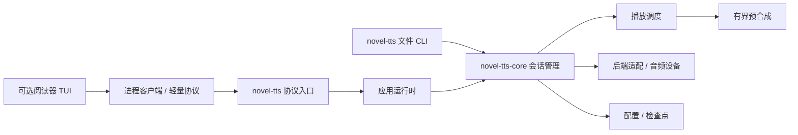

# 听书解耦审查与简化

日期：2026-10-06。基线：`2ab62c07cb41a4eb83385894bd0692963f938855`，范围为全部未提交改动（包含未跟踪文件）。规格：`openspec/changes/decouple-tts-process`。本次允许破坏性重构，不新增兼容层。

## Standards

独立审查发现 3 项架构判断，均已处理：

1. 协议入口混合通信、模型准备、配置事务和会话控制。拆为 `protocol.rs`（通信）和 `runtime.rs`（应用协调），核心 session 下再拆 `playback.rs`、`prefetch.rs`。
2. 通用核心的配置校验硬编码 Kokoro。改为对照注入后端的完整 Capabilities 检查 backend 和 voice。
3. 有界普通队列的 try_send 会丢失 Stop/Chapter/Release。生命周期意图改为有界 watch 通道，独立保留释放/取消代次，普通动作加代次屏障，防止停止后旧操作重新播放。

设置行以枚举替代数字标记；客户端回收子进程提取共享函数；模块采用 `foo.rs`，存在子模块时才建 `foo/`。

## Spec

独立首轮审查发现 4 项行为问题，均已处理：

1. **P1** Start 拒绝后阅读器仍保存不存在的活动会话，下次操作误发 Pause。仅在 Accepted 后提交身份，停止时先失效本地身份。
2. **P1** Seek 可复用旧 session_id，使旧 Cancelled 影响新会话。核心拒绝一个管理器生命周期内所有已使用 ID，验证发生在取消旧会话之前。
3. **P2** 模型准备事件覆盖实际播放状态，Resume 在首段未合成时报告 Playing。核心统一维护真实状态，资源状态独立，Resume/段结束发出实际阶段。
4. **P2** 音色切换依赖阅读器手动重启，直接协议调用只改配置。核心统一替换会话，保留未完成段位置及暂停状态；ConfigChanged 返回新 ID，阅读器删除重复重启逻辑。

修复后复查又发现并修正：关联响应重复广播导致连续更新回滚旧 ID；段结束未通知 Generating；异步发送 Playing 可能覆盖 Pause；命令超时留下未追踪播放；生命周期处理分支的退出取消与代次检查。

## 架构

阅读器不链接原生音频核心；文件 CLI 和协议程序共享同一个核心。没有为尚不存在的插件添加动态加载框架。

## 验证边界

本轮只进行编译、Clippy 和格式检查，未新增或运行测试。此前的试听与发行包验证不视为本次重构后已重跑；人工 TUI、长时间播放、跨平台安装/发行验收仍见 `tts-acceptance.md` 与 OpenSpec 未完成任务。

审查计数：Standards 首轮 3 项（最严重为生命周期操作丢失）；Spec 首轮 4 项（最严重为启动失败后无法正常重试、会话 ID 复用）。以上已修复，复查修复另列。
