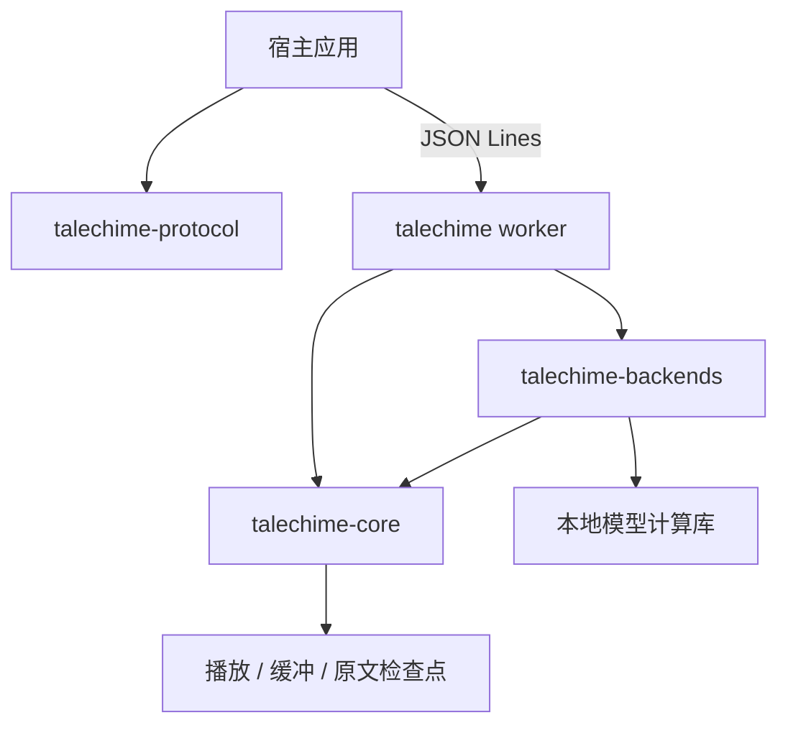

# 架构与集成

Talechime 拥有语音合成和播放；章节获取、阅读界面、角色识别及角色音色绑定由使用方拥有。

## 模块

- `crates/talechime`：CLI、worker、模型准备与设备校准装配、音色命令。
- `crates/talechime-protocol`：协议 v6、配置、能力、来源身份与 UTF-8 范围，不链接音频和模型。
- `crates/talechime-core`：Backend / Playback 接口、会话、背压、音频预算、实际播放进度、配置和检查点。
- `crates/talechime-backends`：Registry、资源清单、参考音频、设备与具体模型适配。
- `crates/{qwen3-tts,moss-tts,voxcpm,omnivoice,tts-candle-platform}`：模型计算及平台路由。
- `crates/voxcpm-sys`：保留原生实现作为独立开发对照，生产 VoxCPM 适配器使用 Candle。

## 所有权与故障边界

会话使用 `Rc` 和 local futures，运行在 Tokio `LocalSet`。模型在专用线程上构建、执行和销毁，通过有界通道传递文本及 PCM；音频设备留在播放线程。取消须先销毁 PCM 接收端，再关闭/等待推理线程，避免有界发送与 join 死锁。

生产完成与播放完成分开。只有显式 End 及有效 PCM 才证明一个合成片段正常结束；流断连、帧数上限或取消不能提交完成检查点。成功生成也不证明逐字朗读完整。PCM 使用不可变共享数据；播放队列独占预算许可，在实际消费后释放。

播放进度与检查点以实际播放的片段为单位。协议入口在等待控制命令时继续消费会话事件，保持有界队列背压与命令串行执行。

worker 的 stdout 只允许协议消息。宿主须排空 stderr，校验协议版本、进程实例、session ID、正文摘要和事件序号。启动、seek 或用户切换整章音色会替换会话；旧事件不可推进新会话进度。下一章由宿主决定，只有 completed 终态允许自动续章。

## 多音色演进边界

Backend 已有逐请求 voice/style，但当前 SessionManager 的生产者使用整章固定音色。未来可增加模型无关的朗读计划，携带原文范围、音色和可选风格；角色 ID 不进入合成后端。

计划应先验证正文摘要、UTF-8 范围、顺序及覆盖，再在每个音色边界内进行模型分段。不得把语义标注片段直接等同于模型 token 片段，也不得跨音色边界合并。首版可限制同一 backend/model，复用权重与参考缓存；逐句重建 worker 或更新全局配置会清空预缓冲，不适合作为正常角色调度。

CastGlean 将 CRLF/CR 规范化为 LF；集成必须把同一份规范化快照交给标注、朗读和高亮，不能直接套用到另一份原文的字节范围。未知与歧义归属的音色回退由宿主明确配置。
