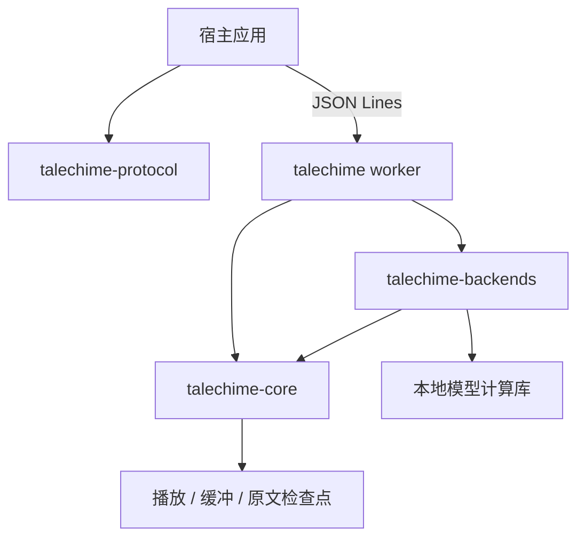
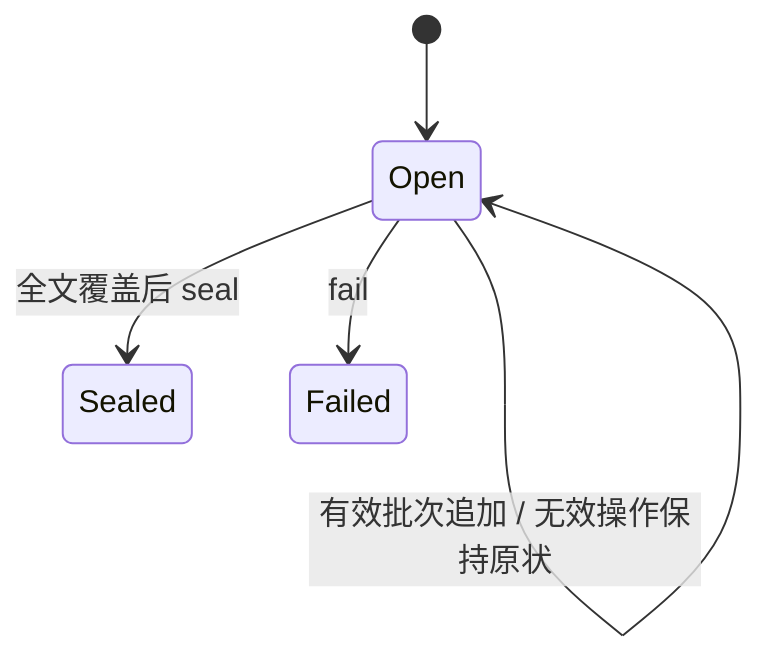

# 架构与集成

Talechime 拥有语音合成和播放；章节获取、阅读界面、角色识别及角色音色绑定由使用方拥有。

## 模块

- `crates/talechime`：CLI、worker、模型准备与设备校准装配、音色命令。
- `crates/talechime-protocol`：协议 v7、配置、能力、来源身份与 UTF-8 范围，不链接音频和模型。
- `crates/talechime-core`：Backend / Playback 接口、会话、背压、音频预算、实际播放进度、配置和检查点。
- `crates/talechime-backends`：Registry、资源清单、参考音频、设备与具体模型适配。
- `crates/{qwen3-tts,moss-tts,voxcpm,omnivoice,tts-candle-platform}`：模型计算及平台路由。
- `crates/voxcpm-sys`：保留原生实现作为独立开发对照，生产 VoxCPM 适配器使用 Candle。

## 所有权与故障边界

会话使用 `Rc` 和 local futures，运行在 Tokio `LocalSet`。模型在专用线程上构建、执行和销毁，通过有界通道传递文本及 PCM；音频设备留在播放线程。取消须先销毁 PCM 接收端，再关闭/等待推理线程，避免有界发送与 join 死锁。

生产完成与播放完成分开。只有显式 End 及有效 PCM 才证明一个合成片段正常结束；流断连、帧数上限或取消不能提交完成检查点。成功生成也不证明逐字朗读完整。PCM 使用不可变共享数据；播放队列独占预算许可，在实际消费后释放。

播放进度与检查点以实际播放的片段为单位。协议入口在等待控制命令时继续消费会话事件，保持有界队列背压与命令串行执行。

worker 的 stdout 只允许协议消息。宿主须排空 stderr，校验协议版本、进程实例、session ID、正文摘要和事件序号。启动或 seek 会替换会话；修改默认音色不改变活动计划；旧事件不可推进新会话进度。下一章由宿主决定，只有 completed 终态允许自动续章。

## 多音色演进边界

Backend 已有逐请求 voice/style，SessionManager 已能消费同模型多音色增量计划。CLI/JSON Lines v7 统一提交计划，单音色也是封闭计划。角色 ID 不进入合成后端。

### 朗读计划契约（T0）

`talechime-core` 根导出 `SourceSnapshot`、`VoiceSnapshot`、`SpeechSpan`、`SpeechPlan`、`PlanState`、`PlaybackPolicy` 和 `PlanError`。这些类型不创建模型、runtime、播放器或文件，也没有新的协议 DTO。

- `SourceSnapshot::new` 以现有 `text_hash` 校验完整正文，保留原始换行、Unicode 和空白；宿主须共享同一份快照。
- `VoiceSnapshot::new` 使用已准备 Backend 的能力建立固定音色集合。backend/model 必须精确一致，显式 model 与 `None` 不互相匹配；先在准备层解析默认模型。音色 ID 唯一且可用。它只冻结能力元数据，参考文件的版本保护仍须在后续执行层实现。
- `SpeechSpan::new` 创建待校验范围、音色与风格；只有被计划接受后才能视为有效。风格为逐段显式值，`None` 不继承全局配置。音色与风格规则复用配置校验，风格须受模型支持、非空白且不超过 200 字符。
- `SpeechPlan::append` 按批次原子接受连续前缀，拒绝空批次、无效 UTF-8 范围、重叠、跳跃或集合外音色；失败不改变计划。所有非空范围（包括空白）都必须被覆盖，实际执行层再决定预处理方式。
- `seal` 仅在全文覆盖后封闭输入，空章可直接封闭；`fail` 显式终止开放输入。终态禁止再追加、封闭或失败终止；已接受内容保持可查。
- `complete` 与 `single_voice` 复用增量校验路径。空章的单音色构造仍验证指定音色及风格。
- `accepted_end` 仅是计划提交进度。`Sealed` 不表示音频生成或播放完成；计划只携带 `PlaybackPolicy`，由会话执行流式或整章暂存后播放。

无模型契约示例：`cargo run --locked -p talechime-core --example speech_plan`。

### 增量多音色会话（T1）

`SessionManager::start_plan` 接收 `SpeechPlan` 与 `PlanSessionOptions`，音量、速度和恢复设置不含音色字段。入口验证当前 Backend 的模型、音色及风格能力，再替换旧会话；无效计划、恢复位置或播放设置不取消旧会话。恢复位置必须在已接受的 UTF-8 前缀内。`Streaming` 达到预缓冲后播放，`AfterChapterReady` 通过 T2 磁盘暂存执行。

控制方法 `append_plan`、`seal_plan`、`fail_input` 均校验 session ID 和活动状态。追加/封闭完成即确认输入接受，不等待合成；分析失败通过 `fail_input` 中止生成与播放，等待已有检查点事务并产生 `input_failed` 错误及唯一 failed 终态。stop 仍是 cancelled；旧 ID 的迟到追加、封闭或失败不能影响新会话。

生产者在每个声音范围内调用模型分段，选择对应音色并更新时长学习。它共享同一 Backend 和连续播放队列，不在音色边界增加停顿或重新加载权重。范围未到达时等待通知，暂停仍只允许有界预取。等待分析时允许排空已完整生成前缀的短尾音频，不把它当成 EOF；完成必须等输入封闭、生成正常结束且所有音频实际播放。

`plan_progress` 返回输入状态、accepted_end、generated_end、played_end 与 waiting_for_input。生成终点仅在完整模型片段结束后更新，播放终点沿用安全的片段检查点语义，不估算逐字进度。等待输入与音频缓冲可通过本地进度区分，本阶段不增加协议事件。

朗读副本清除选定的不可见格式字符及非空白控制字符，控制空白保留词边界，CR/LF 保持原样；原文快照、摘要和 UTF-8 字节范围不变。分段边界与执行层跳过校验共用清洗后的静默行判断。

空白、仅含已清除字符的行及独立装饰行可以作为无音频标记排队，只有前面音频实际消耗后才能推进检查点；后端不能无错误地省略普通正文。空章开放输入也要等待 seal。`seek_plan` 复制固定音色安排到新 ID，从原文字节重新生成，并保留音量、速度和用户暂停；开放计划可以在新 ID 上继续追加。旧 `seek` 对计划会话也保留音色/暂停，仅使用 Config 的音量/速度。`update_settings` 不允许替换活动计划的固定音色，调整音量/速度使用 `configure_playback`，重新选角则启动新计划。

原 `start` 将单音色请求转换成封闭计划，复用同一生产者；既有配置更新和单音色 seek 接口保留。会话依然运行在宿主 LocalSet，事件消费者需并行排空有界事件通道，避免控制操作等待发送时阻塞。模型参考资源的修订保护由适配器现有机制及后续装配层负责，VoiceSnapshot 不持有文件租约。

无模型执行示例：`cargo run --locked -p talechime-core --example plan_session`。使用确定性 Backend/Playback、临时检查点和后台事件消费者；不播放真实音频、不读写用户目录。CLI/worker 通过库入口执行这些计划，不恢复对齐。

计划应先验证正文摘要、UTF-8 范围、顺序及覆盖，再在每个音色边界内进行模型分段。不得把语义标注片段直接等同于模型 token 片段，也不得跨音色边界合并。首版可限制同一 backend/model，复用权重与参考缓存；逐句重建 worker 或更新全局配置会清空预缓冲，不适合作为正常角色调度。

CastGlean 将 CRLF/CR 规范化为 LF；集成必须把同一份规范化快照交给标注、朗读和高亮，不能直接套用到另一份原文的字节范围。未知与歧义归属的音色回退由宿主明确配置。

### 整章生成后播放（T2）

生成和声音切换复用 T1 的唯一生产者；整章模式及时释放生成通道 PCM 的预算许可，逐条写盘，不等待播放器消费。因此边分析边生成可等待后续范围；即使播放暂停，也能准备超过原有 30 秒队列容量的整章。只有正常 Finished（输入已 seal）后，同步文件并扫描校验完整覆盖、顺序、UTF-8 范围、PCM 格式和记录完整性，才设置 `PlanProgress::chapter_ready` 并启动读回。生成或分析失败不播放部分暂存。

暂存私有格式为 `TCHSTG01`：顺序记录 Start/Audio/End/Skipped/Finished，范围记录是原文索引，PCM 为 little-endian f32，记录带类型、长度和 FNV-1a 校验码。校验码用于发现意外损坏，不是安全认证；本格式不是公共交换协议。每段必须有有效 PCM 和对应 End，最后须覆盖本次恢复字节到全文末尾，拒绝截断、未知格式及尾随数据。读回重新校验记录，失败停止播放并保留安全检查点。

`StagingOptions` 限制每执行文件总大小（含记录头，默认 1 GiB）及记录数（一百万），单记录不超过现有单 PCM 块限制（30 秒、16 MiB）。编码/解码只持有固定数量的有界块及其序列化缓冲，不将整章 PCM 或索引放入内存；临时编码内存额外于播放队列的 16 MiB 预算。读回用相同 Budget，消费后归还许可；待播放原文标记最多 64 条，队列满时允许短前缀排空，避免大量微小片段在达到时长预缓冲前互相等待。I/O 使用受跟踪的 spawn_blocking，不移动 Backend、Playback 或 Rc 到 I/O 线程。

父目录下使用固定受管根 `talechime-staging-v1/` 与随机私有执行目录。根锁序列化识别/创建，执行持有独立所有权锁；下次创建时只删除标记正确、未锁定且仅含已知普通文件的遗留目录。未知文件、符号链接和活动执行保留；未完成所有权标记的异常遗留不会自动认领。文件句柄先关闭再删除目录，兼容 Windows。音频在完成、失败或 stop 后删除，受管根与标记保留；不扫描其他用户路径。

stop 等待在途检查点与暂存 I/O；Drop 只能尽力取消，不能宣称已完成异步清理。seek 保留限额/父目录和暂停状态，先取消旧执行再从安全原文位置新建暂存、重新生成。无持久音频缓存、失败生成恢复或暂存复用。生成期间不推进 played_end，也不发 SegmentStarted/Finished；准备成功后按真实播放推进检查点及 Completed。

`SessionError::Staging(StagingError)` 区分 I/O、容量与结构错误，现有事件载体返回 `staging_failed / chapter_staging`；协议 v7 / CLI 已接入两种策略。无模型例子：`cargo run --locked -p talechime-core --example plan_session -- --after-chapter`。

### 统一 Rust 装配（T3）

`talechime/src/lib.rs` 提供薄 facade，Engine 用显式 ModelOptions 准备 Registry，直接合成和可选 Listening 分开。core 的 SynthesisStream 复用唯一 producer，不依赖播放器/配置/检查点；预算由 SpeechAudio 持有直到消费释放，限量收集失败不返回截断 PCM。SessionManager 增加可选检查点装配，旧构造器仍带持久检查点，既有 CLI 行为保留。

Listening 在宿主 LocalSet 持有 SessionManager，通过 16 项有界控制队列和 oneshot 确认接收 Send 控制句柄；Backend、Playback 和 Engine 保持本地 Rc。close 关闭观察者后使用 core 的无事件关闭路径，避免慢/退出消费者阻塞清理；显式 stop 保留可靠 cancelled 事件和可复用装配。Drop 只请求清理，预约由 owner 持有到全部任务/I/O 释放，不能提前开始另一执行。producer 的完整生命周期也纳入会话关闭等待；跨线程取消直接流通过 AbortHandle 和完成通知，不移动模型。

Engine 同时只接受一项直接合成或一个 Listening owner。直接流完成/失败/显式取消后可复用；丢弃流先请求取消，准备 owner 等其资源释放后才解除 Busy。MOSS Nano 的初始化接收端先关闭，再关闭请求通道并 join 原生线程，算法/模型不变。自定义后端的外部所有权仍由宿主管理。

当前支持宿主现有/自建 LocalSet 和宿主明确创建的线程，不自动管理后台会话线程。库沿用模型 feature，并用 cli feature 分离 executable 与终端参数依赖；播放器仍参与 core 编译；CLI/worker 已直接装配库的 ListeningSession，使用宿主原有事件队列。详细使用、事件背压和生命周期限制见 [Rust 库入口](library.md)。

### 计划协议与应用装配（T4）

按当前项目决定直接升级 JSON Lines v7，不建立旧版本适配或扩展协商。start 的 payload 是 PlanRequest；append/seal/fail_input/get_progress 复用领域计划与控制句柄。单音色没有独立 wire start 路径。DTO 转换集中在 plan_input.rs，正文摘要、声音/风格和 UTF-8 覆盖规则只在 core 校验。

ListeningSession 是执行 owner，Listening 是该 owner 与库自建事件接收端的便利组合。CLI/worker 直接把现有有界事件 sender 交给 Engine，不创建转发任务、额外事件队列或 flush 协议。关闭 owner 通过独立取消信号唤醒 actor，等待生产和暂存清理；正常 stop 的终态直接留在宿主事件队列中。

配置音色/风格只为未来计划提供默认值，活动计划的声音安排固定；播放音量/速度可以独立更新。模型/设备变更取消活动执行并释放已准备 owner。CLI --plan 要求与文件相同的正文且已封闭；--after-chapter 为单音色选择整章暂存策略。宿主 runtime/线程、现有设备选择与模型准备策略保持明确所有权。

先完善 Talechime 通用 API，CastGlean 完成后再共同接入 TRNovel。当前未修改另两个仓库，也未承诺真实模型听感、资源租约保护或完整音频导出。

## 可选内容门禁

计划执行与直接 PCM 流共用 producer。开启回读时，producer 有界收集实际 TTS 片段，经 Verifier 主识别/跨家族复核后先发布报告，再发布接受的 PCM；只对共同确认异常重合成同一片段。报告-only 也收集片段，但不阻止内容异常的交付。AfterChapterReady 在这一阶段之后暂存，全章成功才进入播放。原生 ASR 各有请求容量为 1 的 owner，取消会终止请求并在显式关闭时等待在途工作。报告与 PCM 保持原有有界背压，不在事件转发层另建后台队列。契约及模型组见[回读校验](readback.md)。

## 执行级接续参考

producer 在当前执行内保存最多一个 `SpeechContext`（不可变共享 PCM 与生成文字），
与全局音色缓存和模型张量隔离。支持的 Backend 通过 `stream_with_context` 接收可选前段。
候选在接收原始流时有界复制，播放无需等待候选完成；End 后且交付策略允许时才替换参考。
门禁拒绝的尝试不进入候选，重试使用原快照。参考限额与重置语义见[库说明](library.md#段落内接续)。

默认 MOSS Nano 使用 Candle，ONNX 保留为显式 `nano` 模型项。未指定 MOSS 模型时，能力目录、
设备选择、准备路径与校准 revision 均解析到 `nano-candle`（已编译时）；只启用 `moss` 的构建使用 ONNX。
MOSS Nano 用前段转写与当前文字建立无用户参考的 continuation prompt，把音频 codes 放入
assistant 前缀；codec 先消费前缀建立状态，丢弃前缀 PCM 后只输出新帧。Qwen 0.6B Base
复用 Base ICL 编码，OmniVoice 复用 VoiceClonePrompt；临时 prompt 均只存在原生 owner 的内存中。
