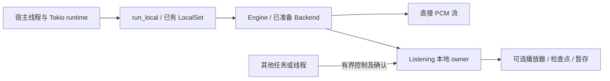

# Rust 库入口

`talechime` 包现在同时提供 library 和原有 executable。应用可只调用库，不需要解析 CLI 配置、发送 JSON Lines 或手动装配 Registry/SessionManager。首期一个 Engine 固定一个已准备的 backend/model/device，同时只拥有一个执行；多音色限同模型内。

## 准备和直接合成

在现有 workspace 外通过 path 依赖试用，模型 feature 沿用现有名称：

```toml
[dependencies]
talechime = { path = "../talechime/crates/talechime", default-features = false, features = ["moss"] }
tokio = { version = "1", features = ["rt", "macros", "time"] }
```

```rust,no_run
use talechime::{Engine, ModelOptions, SynthesisState, run_local};

#[tokio::main(flavor = "current_thread")]
async fn main() -> Result<(), Box<dyn std::error::Error>> {
    run_local(async {
        let options = ModelOptions::new("moss", "./my-app-models");
        let mut engine = Engine::prepare(options, |event| eprintln!("{event:?}")).await?;
        let voice = engine.capabilities()?.default_voice;
        let mut stream = engine.synthesize("你好，世界。", &voice, None)?;
        while let Some(block) = stream.recv().await {
            let block = block?;
            // Feed a host-owned sink here, then release the block's budget permit.
            println!("{} samples for {:?}", block.pcm().samples.len(), block.range());
        }
        assert_eq!(stream.state(), SynthesisState::Completed);
        engine.close().await?;
        Ok::<_, Box<dyn std::error::Error>>(())
    }).await
}
```

准备是显式操作，可能下载指定模型；资源父路径由宿主传入，不读取或写入全局 CLI 配置。默认 CPU，可显式选择 Registry 报告可用的设备；`Auto` 需由宿主先解析，装配层按选择调用既有模型准备流程。实际模型身份由准备后的 capabilities 返回。直接合成不打开音频设备、不写检查点或暂存文件；仍使用同一声音校验、模型分段、边界静音与原文范围规则。

`SpeechAudio` 持有 PCM 和预算许可，提供只读 `pcm()`、`range()`。保留块会施加背压，释放后归还预算；队列以 30 秒/16 MiB 限制，原始输入块在边界处理前也检查同一限制。宿主自行复制/缓存 PCM 的内存由宿主管理。简单收集使用 `engine.synthesize_pcm(text, voice, style, max_bytes)`；限制必须非零，超限或跨片段格式改变返回错误并取消执行，不返回截断音频。空白/空文本可以正常生成完成，但收集辅助方法报 `EmptyAudio`。

有效 PCM 前缀之后仍可能合成失败。`recv()` 返回错误后保持 Failed；None 也可能来自取消，不能仅靠流耗尽认定成功，需检查 `SynthesisState::Completed`。生成完成不表示播放完成。

## 可选回读校验

显式 `prepare_readback` 后用 `engine.set_verifier` 装配一次，按次 `synthesize_verified(..., VerificationOptions)` 或设置 `PlanSessionOptions.verification`；默认关闭。`Verifier::report` 支持只有已有音频的报告场景，不需要 TTS 或播放。完整策略、事件、取消与示例见[回读校验](readback.md)。

## 构造计划

```rust,no_run
# use talechime::*;
# fn plan(engine: &Engine, source: SourceSnapshot) -> Result<SpeechPlan, EngineError> {
let mut plan = engine.plan(source, vec!["A".into(), "B".into()], PlaybackPolicy::Streaming)?;
plan.append(vec![SpeechSpan::new(TextRange { start: 0, end: 3 }, "A", None)])
    .map_err(SessionError::from)?;
// 可直接启动开放计划，随后通过控制句柄追加和封闭。
# Ok(plan)
# }
```

`Engine::plan` 自动绑定本 Engine 已准备的准确模型身份和能力，宿主只提供正文快照、允许的音色和策略。单音色直接使用 `single_voice_plan(source, voice, style, policy)`，得到已封闭的完整计划；空正文也会检查音色和风格。完整多音色计划仍由同一路径 append 全部范围再 seal，不维护第二套执行逻辑。

## 播放和计划控制

```rust,no_run
# use talechime::*;
# async fn attach(engine: &Engine, chapter: SpeechPlan) -> Result<(), EngineError> {
let mut listening = engine.listen(ListeningOptions::default())?;
let control = listening.control();
control.start("chapter-1", chapter, PlanSessionOptions::default()).await?;
while let Some(event) = listening.recv().await {
    if let Event::SessionEnded { reason, .. } = event.event {
        println!("{reason:?}");
        break;
    }
}
listening.close().await?;
# Ok(())
# }
```

`listen` 才打开默认音频设备；高级宿主通过 `listen_with` 注入 Playback。宿主已有有界事件队列时，用 `listen_to(options, events)`；同时注入播放器则用 `listen_with_events(player, options, events)`。这两个入口返回 `ListeningSession`，会话直接投递到宿主队列，没有转发任务或第二个事件队列。宿主掌握队列容量（最多 4096），`ListeningOptions::event_capacity` 只控制库自建队列。`ListeningOptions::checkpoints` 默认 None，不建立磁盘检查点；恢复检查点必须提供路径，否则在替换旧执行前报错。显式目录仍采用既有检查点格式和原文校验。

`ListeningHandle` 有界控制队列最多 16 项，每个操作返回确认或错误。`start / append / seal / fail_input / pause / resume / seek / configure_playback / progress / status / stop` 直接复用 SessionManager。旧 ID 操作不能影响新执行；stop 明确取消当前执行、保留监听装配，close 则结束整个 Listening 所有权。原有多音色、增量输入和 AfterChapterReady 暂存规则见[架构说明](architecture.md)。

事件队列容量为 1..=4096，默认 64；宿主须在等待控制时并行消费事件。事件保持原有可靠有界背压，慢观察者仍会影响执行；高频观察快照/协议调度属于后续阶段，不宣称已解决。`Listening::close` 独立于事件消费：关闭投递、丢弃尚未消费事件、取消并等待生成/读回和在途 I/O，之后释放 Engine 预约；不会把行政关闭当 Completed。丢弃 Listening 会请求相同清理，但 Drop 不代表异步清理已经完成。`ListeningSession::close` 同样绕过观察者压力并等待清理，已经投递的事件由宿主保留和消费。

## 执行环境和关闭



库不创建会话后台线程或全局 runtime；`run_local` 在宿主已有 runtime 内建立 LocalSet，高级宿主可以使用自己的 LocalSet。Engine、PcmStream 和 Listening 保留 Rc 所有权，不能跨线程移动。`ListeningHandle`、`CancellationHandle` 为 Send + Sync，控制不会移动模型和音频对象。控制方法需要所属 LocalSet 保持运行。

直接流可以克隆 `cancellation()` 请求跨线程取消；这只是请求，流的 `cancel().await` 才释放接收端/排队 PCM 并等待生产者清理。`CancellationHandle::closed` 等待本地生产者释放资源，不能推断宿主所有 PCM 消费已完成。丢弃直接流后 Engine 保持 Busy，直到取消生产者完成；Engine::close 会等待这类已丢弃流。尚存活的流或 Listening 必须先显式关闭，Engine::close 返回 Busy，不偷偷结束宿主拥有的执行。

准备好的 Engine 可以在执行结束后复用模型；Engine::close 释放模型所有权。原生适配器的 owner 负责关闭请求通道和等待线程退出；MOSS Nano 本阶段补齐了与其他生产适配器一致的线程持有/初始化取消顺序。自定义 Backend 或 Playback 的额外所有者与异步资源仍由提供方管理，外部 Rc 不会被强行销毁。

## 无模型示例和边界

```sh
cargo run --locked -p talechime --example synthesize
cargo run --locked -p talechime --example listen_text
cargo run --locked -p talechime --example listen_plan
cargo run --locked -p talechime --example host_thread
```

上述示例用确定性 Backend/Playback，验证直接合成、单音色、多音色和宿主自建线程，不下载模型、不打开真实音频设备、不写用户目录。`prepare_model` 是明确会准备/可能下载模型的示例，普通测试只编译，不运行；使用 `cargo run --locked -p talechime --example prepare_model -- BACKEND RESOURCE_DIR [MODEL]` 手动执行。

库沿用现有模型 feature；`default-features = false` 可仅启用所需适配器或注入自定义 backend。`cli` feature 控制 executable 与 clap/crossterm 等 CLI 依赖；嵌入库设置 default-features=false，再选择所需模型，或直接注入自定义 Backend。播放器依赖仍参与 core 编译，运行时可不装配。CLI/worker 现在复用这个库入口，协议 v7 只有计划 start 路径，无旧版本协商层。音色资源版本/租约保护、真实模型听感和平台性能不能由本阶段夹具验证推断。

首期交付顺序是 Talechime API 与确定性验收，再等待 CastGlean 标注契约完成，最后共同接入 TRNovel；当前不把阅读器兼容作为库接口约束。

## 段落内接续

`PlanSessionOptions::continuation` 与 `SynthesisOptions::continuation` 默认开启。
`Engine::synthesize_with_options` / `synthesize_pcm_with_options` 接收直接合成选项；
原便利入口使用默认设置。一次调用内部滚动使用上一段完整的生成文字与原始 PCM，
独立调用不共享历史。只有能力目录 `continuation=true` 的 OmniVoice、Qwen **0.6B Base**、
MOSS Nano 使用这一条件；其他模型保持既有合成方式。

```rust,ignore
let mut stream = engine.synthesize_with_options(
    text, voice, None,
    talechime::SynthesisOptions { continuation: false, ..Default::default() },
)?;
```

软换行、生成分块与相同音色/风格的连续 span 保留一段参考。空段、装饰线、标题、
音色或风格变化清空；新执行、seek、恢复、停止和失败也清空。两种播放策略遵循相同规则。
参考是静音边界处理、音量和变速之前的完整音频，只接受 1–15 秒、最多 2048 UTF-8
文字字节、非静音且有限的 PCM。前段与候选参考合计最多 16 MiB，超限整段丢弃并记录原因。
只有显式 End 和成功交付的段落可以更新参考；门禁重试始终使用同一前段。
回读发现异常但仍交付的音频不作为下一段参考。接续编码或推理失败会终止合成。

Qwen `0.6b-base` 必须先导入带准确转写的参考音色，其资源与 `0.6b-customvoice`
隔离，默认模型仍为 CustomVoice。接续不写入临时音色、不自动迁移或生成预置参考。
能力标记表示实现已提供，听感改善须试听对照音频后单独验收。
